# 🎨 zhihui-nodes-comfyui / 潪AI ComfyUI 节点包
[](https://github.com/ZhiHui6/zhihui_nodes_comfyui) [](LICENSE) [](https://github.com/comfyanonymous/ComfyUI)
---

## 📖 项目介绍 | Project Introduction

这是一个由<span style="color: red;"> **Binity** </span>精心创建的 ComfyUI 自定义节点工具合集，旨在为用户提供一系列实用、高效的节点，以增强和扩展 ComfyUI 的功能。本节点集包含30+功能节点，涵盖文本处理、提示词优化、图像处理、翻译工具、Latent处理等多个方面，为您的 AI 创作提供全方位支持。

This is a ComfyUI custom node collection carefully created by <span style="color: red;"> **Binity** </span>, designed to provide users with a series of practical and efficient nodes to enhance and extend ComfyUI's functionality. This node collection contains 25+ functional nodes, covering text processing, prompt optimization, image processing, translation tools, Latent processing and many other aspects, providing comprehensive support for your AI creation.

### ✨ 主要特点 | Key Features

- 🔄 **双语翻译节点**：提供百度翻译、腾讯翻译、免费在线翻译三节点，支持中英文本双向转换。<br>**Bilingual Translation Nodes**: Provides three translation nodes - Baidu Translate, Tencent Translate, and Free Online Translate, supporting bidirectional Chinese-English text conversion.

- 📝 **全面文本处理**：提供多行文本编辑、文本合并分离、内容提取修改、语言过滤等5类文本操作节点。<br>**Comprehensive Text Processing**: Provides 5 categories of text operation nodes including multi-line text editing, text merging and separation, content extraction and modification, language filtering, etc.

- 🎯 **智能提示词系统**：Kontext预设增强版、摄影提示词生成器、万相视频提示词生成器等专业的提示词生成工具。<br>**Intelligent Prompt System**: Professional prompt generation tools including Kontext Presets Enhanced, Photography Prompt Generator, WAN Video Prompt Generator, etc.

- 🖼️ **实用图像工具**：支持多算法图像缩放、智能切换、颜色移除等等。<br>**Practical Image Tools**: Supports multi-algorithm image scaling, intelligent switching, color removal, and more.

- 🌐 **完整汉化支持**：提供专门的中文汉化文件，配合 ComfyUI-DD-Translation 扩展使用，让中文用户能够更便捷地使用各个节点功能。详细说明请参考 [Localization_Guide.md](doc/Localization_Guide.md)。<br>**Complete Chinese Localization**: Provides dedicated Chinese localization files that work with ComfyUI-DD-Translation extension, allowing Chinese users to use node functions more conveniently. For detailed instructions, please refer to [Localization_Guide.md](doc/Localization_Guide.md).

如果这个项目对您有帮助，请给我们一个 ⭐**Star**！您的支持是我们持续改进的动力。
If this project helps you, please give us a ⭐**Star**! Your support is our motivation for continuous improvement.

## ⭐ 明星节点 | Featured Nodes

🔥 **<span style="color: #FF6B35; font-weight: bold; font-size: 1.1em;">以下是本节点集中重点推荐的特色节点：</span>**
**<span style="color: #FF6B35; font-weight: bold; font-size: 1.1em;">The following are the featured nodes highly recommended in this node collection:</span>**

<table>
<tr>
<th width="30%">节点名称 | Node Name</th>
<th width="15%">类别 | Category</th>
<th>核心功能 | Core Features</th>
</tr>

<tr>
<td><b>🎯Kontext预设增强版</b><br><b>Kontext Presets Plus</b><br><code>KontextPresetsPlus</code></td>
<td>提示词处理<br>Prompt Processing</td>
<td>内置20+创意预设的Kontext图像编辑预设工具，支持用户自定义预设扩展，集成多种LLM模型免费在线智能扩写。
<br>Kontext image editing preset tool with 20+ built-in creative presets, supports user-defined preset extensions, integrates multiple LLM models for free online intelligent expansion.</td>
</tr>

<tr>
<td><b>🎬万相视频提示词生成器</b><br><b>Wan Prompt Generator</b><br><code>WanPromptGenerator</code></td>
<td>提示词处理<br>Prompt Processing</td>
<td>基于万相2.2官方文档编写的全能型提示词生成器，支持自定义和预设两种组合方法，涵盖运镜、场景、光线、构图等17个维度的专业视频提示词生成。<br>Comprehensive prompt generator based on Wan 2.2 official documentation, supports both custom and preset combination methods, covering 17 professional dimensions including camera movement, scenes, lighting, composition for professional video prompt generation.</td>
</tr>

<tr>
<td><b>📸摄影提示词生成器</b><br><b>Photography Prompt Generator</b><br><code>PhotographPromptGenerator</code></td>
<td>提示词处理<br>Prompt Processing</td>
<td>专业摄影风格提示词生成器，涵盖人物、场景、镜头、光线等15个维度，一键生成专业摄影提示词。<br>Professional photography style prompt generator covering 15 dimensions including characters, scenes, lenses, lighting, generating professional photography prompts with one click.</td>
</tr>

<tr>
<td><b>🤖系统引导词加载器</b><br><b>System Prompt Loader</b><br><code>SystemPromptLoader</code></td>
<td>提示词处理<br>Prompt Processing</td>
<td>专业系统引导词预设工具，内置众多类别模板，输出引导内容给下游LLM节点生成专业的提示词。<br>Professional system prompt preset tool with built-in multiple category templates, outputting guidance content to downstream LLM nodes for generating professional prompts.</td>
</tr>

<tr>
<td><b>🔍额外引导选项</b><br><b>Extra Options</b><br><code>ExtraOptions</code></td>
<td>提示词处理<br>Prompt Processing</td>
<td>类似JoyCaption额外选项的通用式图像反推辅助，集成了5种反推类型，提供26个精细化选项开关。<br>Universal image reverse engineering assistant similar to JoyCaption extra options, integrating 5 reverse engineering types with 26 fine-grained option switches.</td>
</tr>

</table>

💡 **使用建议**：新用户建议从 **摄影提示词生成器** 和 **万相视频提示词生成器** 开始体验，这两个节点能够快速提升您的创作效率和作品质量。
**Usage Recommendation**: New users are recommended to start with **Photography Prompt Generator** and **Wan Prompt Generator**, these two nodes can quickly improve your creative efficiency and work quality.

---

## 🛠️ 节点功能说明 | Node Function Description

本节点集包含众多功能各异的节点，分为以下几个主要类别：
This node collection contains numerous nodes with different functions, divided into the following main categories:

### 📝 文本处理类节点 | Text Processing Nodes

<table>
<tr>
<th width="30%">节点名称 | Node Name</th>
<th>功能描述 | Function Description</th>
</tr>
<tr>
<td><b>多行文本</b><br><b>Multi-line Text</b><br><code>MultiLineTextNode</code></td>
<td>提供一个支持多行输入的文本框，并带注释功能。<br>Provides a text box that supports multi-line input with annotation functionality.

<br>
<div align="left">
<a href="images/多行文本.jpg" target="_blank">
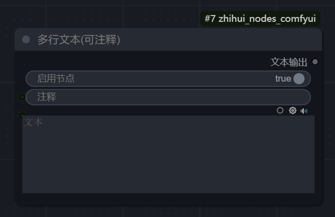
</a>
</div></td>
</tr>
<tr>
<td><b>提示词合并器(可注释)</b><br><b>Prompt Combiner (with annotations)</b><br><code>TextCombinerNode</code></td>
<td>合并两个文本输入，并可通过独立的开关控制每个文本的输出，并带注释功能。可用于动态组合不同的提示词部分，灵活构建完整提示。<br>Combines two text inputs and can control the output of each text through independent switches, with annotation functionality. Can be used to dynamically combine different prompt parts and flexibly build complete prompts.

<br>
<div align="left">
<a href="images/提示词合并器.jpg" target="_blank">
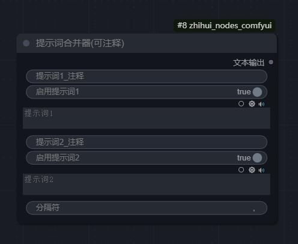
</a>
</div></td>
</tr>
<tr>
<td><b>文本修改器</b><br><b>Text Modifier</b><br><code>TextModifier</code></td>
<td>根据指定的起始和结束标记提取文本内容，并自动去除多余的空白字符。适合从复杂文本中提取特定部分，或进行格式清理。<br>Extracts text content based on specified start and end markers, and automatically removes excess whitespace. Suitable for extracting specific parts from complex text or format cleaning.

<br>
<div align="left">
<a href="images/文本修改器.jpg" target="_blank">
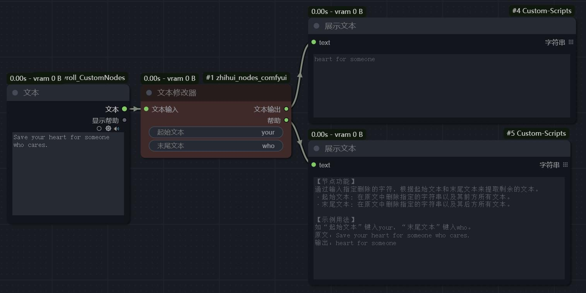
</a>
</div></td>
</tr>
<tr>
<td><b>中英文本提取器</b><br><b>Chinese-English Text Extractor</b><br><code>TextExtractor</code></td>
<td>从混合文本中提取纯中文或纯英文字符，支持标点和数字的提取，并自动清理格式。对于处理双语提示词或分离不同语言内容非常有用。<br>Extracts pure Chinese or English characters from mixed text, supports extraction of punctuation and numbers, and automatically cleans formatting. Very useful for processing bilingual prompts or separating content in different languages.<br><br>
<div align="left">
<a href="images/中英文本提取器.jpg" target="_blank">
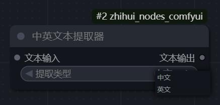
</a>
</div></td>
</tr>

<tr>
<td><b>提示词扩展(通用)</b><br><b>Text Expander (Universal)</b><br><code>TextExpander</code></td>
<td>

使用多种LLM模型对输入文本进行智能扩写和创意增强，支持字符量控制和自定义系统引导词。<br>Uses multiple LLM models for intelligent expansion and creative enhancement of input text, supporting character count control and custom system prompts.

<b>特点 | Features</b>：
- <b>多模型支持 | Multi-model Support</b>：支持claude、deepseek、gemini、openai、mistral、qwen-coder、llama、sur、unity、searchgpt、evil等11种AI模型<br>Supports 11 AI models including claude, deepseek, gemini, openai, mistral, qwen-coder, llama, sur, unity, searchgpt, evil
- <b>字符量控制 | Character Count Control</b>：可精确控制输出文本的字符数量，确保生成内容符合要求<br>Precisely controls the character count of output text, ensuring generated content meets requirements
- <b>创意温度调节 | Creative Temperature Control</b>：通过温度参数控制生成内容的创意程度（0.1-2.0）<br>Controls the creativity level of generated content through temperature parameters (0.1-2.0)
- <b>系统引导词 | System Prompts</b>：支持自定义系统引导词，引导AI生成特定风格的内容<br>Supports custom system prompts to guide AI in generating content with specific styles
- <b>灵活输入 | Flexible Input</b>：支持直接输入系统引导词或通过外部节点加载<br>Supports direct input of system prompts or loading through external nodes

<div align="left">
<a href="images/提示词扩展(通用).jpg" target="_blank">

</a>
</div>
</td>
</tr>
<tr>
<td><b>文本显示器</b><br><b>Text Display</b><br><code>ShowText</code></td>
<td>用于在ComfyUI界面中显示文本内容的节点，支持多行文本展示，可实时显示上游节点传递的文本信息，便于调试和查看中间结果。<br>A node for displaying text content in the ComfyUI interface, supports multi-line text display, can display text information passed from upstream nodes in real time, convenient for debugging and viewing intermediate results.

<br>
<div align="left">
<a href="images/文本显示器.jpg" target="_blank">
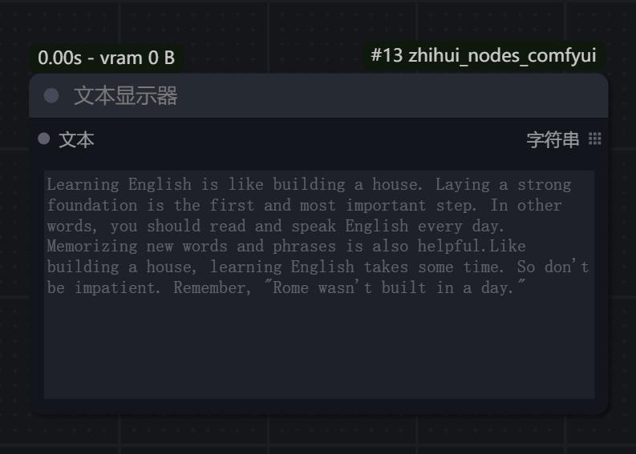
</a>
</div>
</td>
</tr>
<tr>
<td><b>文本编辑器（继续运行）</b><br><b>Text Editor with Continue</b><br><code>TextEditorWithContinue</code></td>
<td>交互式文本编辑节点，暂停工作流执行并提供可编辑文本区域，用户可在运行时修改文本内容，点击继续按钮恢复工作流执行。<br>Interactive text editing node that pauses workflow execution and provides an editable text area, allowing users to modify text content at runtime and resume workflow execution by clicking the continue button.

<b>特点 | Features</b>：
- <b>工作流暂停 | Workflow Pause</b>：自动暂停工作流执行，等待用户交互<br>Automatically pauses workflow execution, waiting for user interaction
- <b>实时编辑 | Real-time Editing</b>：提供可编辑文本区域，支持多行文本编辑<br>Provides editable text area with multi-line text editing support
- <b>手动同步 | Manual Sync</b>：编辑后需手动点击同步按钮更新内容<br>Requires manual sync button click to update content after editing

<b>使用场景 | Use Cases</b>：
- 工作流中需要人工干预和文本调整的场景<br>Scenarios requiring manual intervention and text adjustment in workflows
- 提示词的实时优化和调试<br>Real-time optimization and debugging of prompts

<br>
<div align="left">
<a href="images/Text Editor with Continue.jpg" target="_blank">

</a>
</div>
</td>
</tr>
</table>

### 🎯 提示词处理类节点 | Prompt Processing Nodes

<table>
<tr>
<th width="30%">节点名称 | Node Name</th>
<th>功能描述 | Function Description</th>
</tr>
<tr>
<td><b>Kontext预设基础版</b><br><b>Kontext Presets Basic</b><br><code>LoadKontextPresetsBasic</code></td>
<td>提供专业的图像变换预设库，包含13项专业预设。为图像生成提供风格化指导，帮助用户快速应用常见的艺术风格和效果。
<br>Provides a professional image transformation preset library with 13 professional presets. Offers stylistic guidance for image generation, helping users quickly apply common artistic styles and effects.

<br>
<div align="left">
<a href="images/Kontext预设集基础版.jpg" target="_blank">
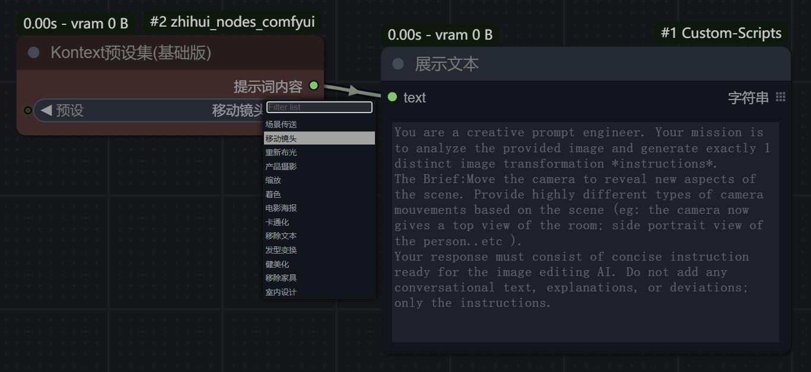
</a>
</div>
</td>
</tr>
<tr>
<td><b>Kontext预设增强版</b><br><b>Kontext Presets Plus</b><br><code>KontextPresetsPlus</code></td>
<td>

提供专业的图像变换预设，内置免费在线扩写功能，支持用户自定义预设，为图像编辑提供创意指导。<br>Provides professional image transformation presets with built-in free online expansion functionality, supports user-defined presets, and offers creative guidance for image editing.

<b>特点 | Features</b>：
- <b>丰富预设库 | Rich Preset Library</b>：包含20余项专业预设<br>Contains 20+ professional presets

- <b>双预设库 | Dual Preset Libraries</b>：支持默认预设和用户自定义预设，用户可自由新增更多创意预设，通过分类标识区分预设来源。<a href="doc/Kontext_Presets_User_File_Instructions.md" style="font-weight:bold;color:yellow;">用户预设使用说明</a><br>Supports both default presets and user-defined presets, users can freely add more creative presets, distinguished by category identifiers. <a href="doc/Kontext_Presets_User_File_Instructions.md" style="font-weight:bold;color:yellow;">User Preset Usage Guide</a>
- <b>智能扩写 | Intelligent Expansion</b>：支持多种LLM模型（OpenAI、Mistral、Qwen等）对预设内容进行创意扩写<br>Supports multiple LLM models (OpenAI, Mistral, Qwen, etc.) for creative expansion of preset content
- <b>灵活输出 | Flexible Output</b>：支持输出原始预设内容、完整信息或AI扩写后的内容<br>Supports output of original preset content, complete information, or AI-expanded content

<div align="left">
<a href="images/Kontext预设增强版节点展示.jpg" target="_blank">
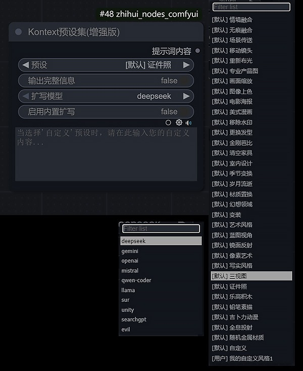
</a>
<a href="images/Kontext预设增强版效果预览.jpg" target="_blank">
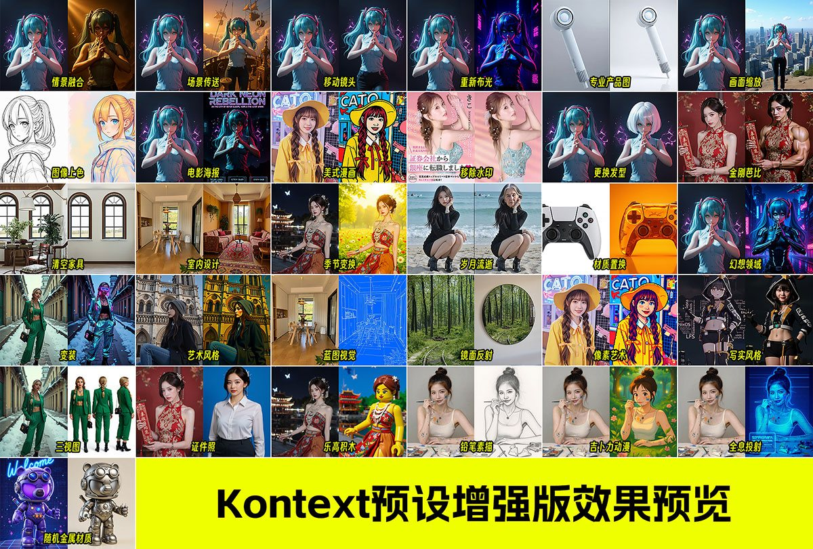
</a>
</div>
</td>
</tr>
<tr>
<td><b>摄影提示词生成器</b><br><b>Photography Prompt Generator</b><br><code>PhotographPromptGenerator</code></td>
<td>

根据预设的摄影要素（如相机、镜头、光照、场景等）组合生成专业的摄影风格提示词。<br>Generates professional photography style prompts by combining preset photography elements (such as cameras, lenses, lighting, scenes, etc.).

<b>特点 | Features</b>：
- 支持从自定义文本文件加载选项，灵活扩展<br>Supports loading options from custom text files for flexible expansion
- 支持随机选择，增加创意多样性<br>Supports random selection to increase creative diversity
- 输出模板可自定义，适应不同的摄影风格需求<br>Customizable output templates to adapt to different photography style requirements

<div align="left">
<a href="images/摄影提示词生成器.jpg" target="_blank">
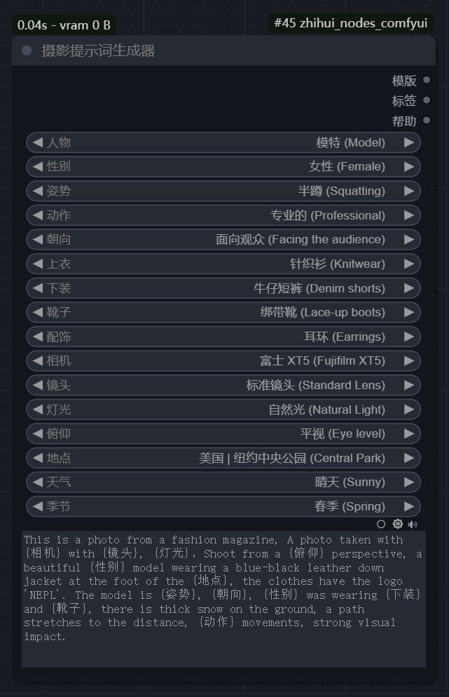
</a>
</div>
</td>
</tr>
<tr>
<td><b>万相视频提示词生成器</b><br><b>🎬 Wan Prompt Generator</b><br><code>WanPromptGenerator</code></td>
<td>

基于万相2.2官方文档编写的全能型提示词生成器，支持自定义和预设两种组合方法，涵盖运镜、场景、光线、构图等16个维度的专业视频提示词生成。<br>Comprehensive prompt generator based on Wan 2.2 official documentation, supports both custom and preset combination methods, covering 16 professional dimensions including camera movement, scenes, lighting, composition for professional video prompt generation.

<b>特点 | Features</b>：
- <b>双模式切换 | Dual Mode Switching</b>：支持自定义组合和预设组合模式，通过开关按钮一键切换<br>Supports both custom and preset combination modes, one-click switching through toggle buttons
- <b>多维度选择 | Multi-dimensional Selection</b>：涵盖主体类型、场景类型、光源类型、光线类型、时间段、景别、构图、镜头焦段、机位角度、镜头类型、色调、运镜方式、人物情绪、运动类型、视觉风格、特效镜头、动作姿势17个专业维度<br>Covers 17 professional dimensions including subject type, scene type, light source type, lighting type, time period, shot size, composition, lens focal length, camera angle, lens type, color tone, camera movement, character emotion, motion type, visual style, special effects shots, action poses
- <b>智能扩写 | Intelligent Expansion</b>：支持多种LLM模型（OpenAI、Claude、DeepSeek、Gemini等）免费在线扩写<br>Supports multiple LLM models (OpenAI, Claude, DeepSeek, Gemini, etc.) for free online expansion

<div align="left">
<a href="images/万相视频提示词生成器.jpg" target="_blank">
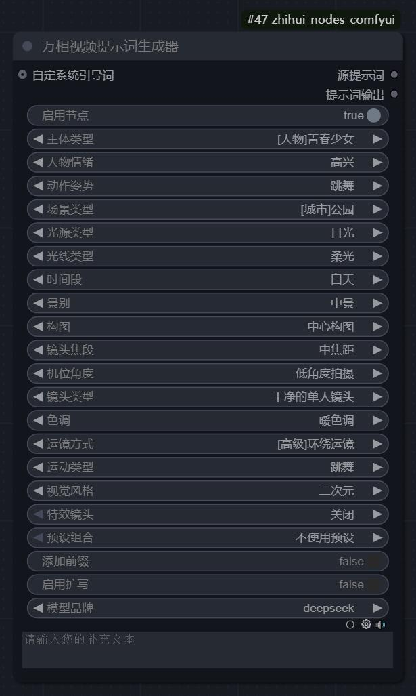
</a>
</div>
</td>
</tr>

<tr>
<td><b>提示词预设 - 单选</b><br><b>Prompt Preset - Single Choice</b><br><code>PromptPresetOneChoice</code></td>
<td>提供6个预设选项，用户可以方便地在不同预设之间切换。适合保存常用的提示词模板，快速应用到不同场景。<br>Provides 6 preset options, allowing users to conveniently switch between different presets. Suitable for saving commonly used prompt templates and quickly applying them to different scenarios.

<br>
<div align="left">
<a href="images/单选提示词预设.jpg" target="_blank">
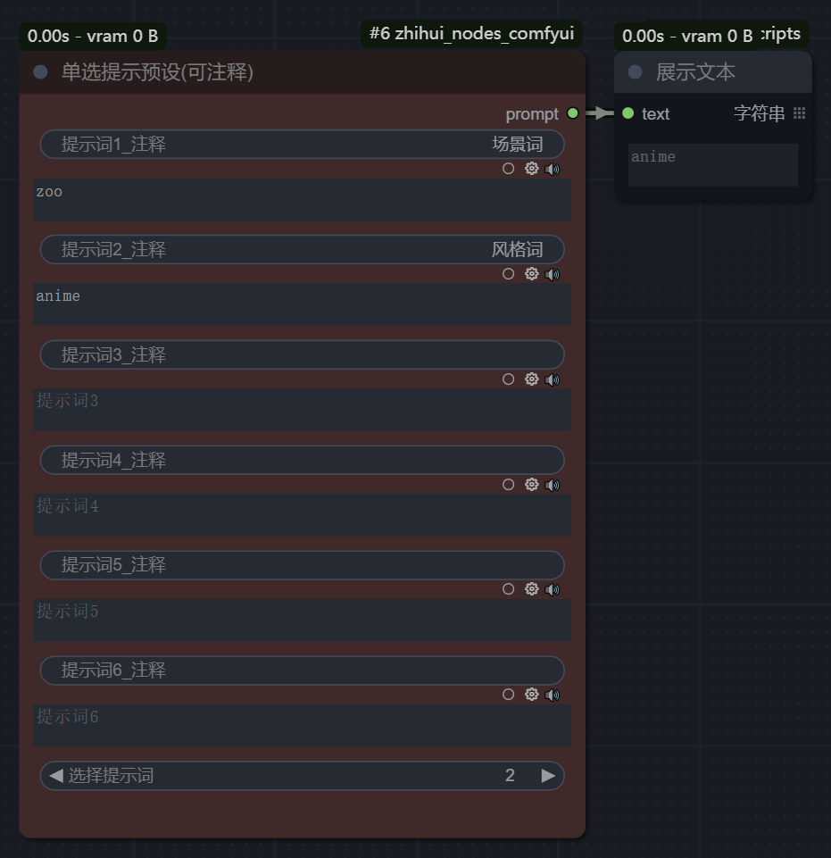
</a>
</div></td>
</tr>
<tr>
<td><b>提示词预设 - 多选</b><br><b>Prompt Preset - Multiple Choice</b><br><code>PromptPresetMultipleChoice</code></td>
<td>支持同时选择多个预设，并将它们合并输出，每个预设都带有独立的开关和注释功能。适合构建复杂的组合提示词，灵活控制各部分的启用状态。<br>Supports simultaneous selection of multiple presets and merges them for output, with each preset having independent switches and annotation functionality. Suitable for building complex combined prompts and flexibly controlling the enabled state of each part.

<br>
<div align="left">
<a href="images/多选提示词预设.jpg" target="_blank">
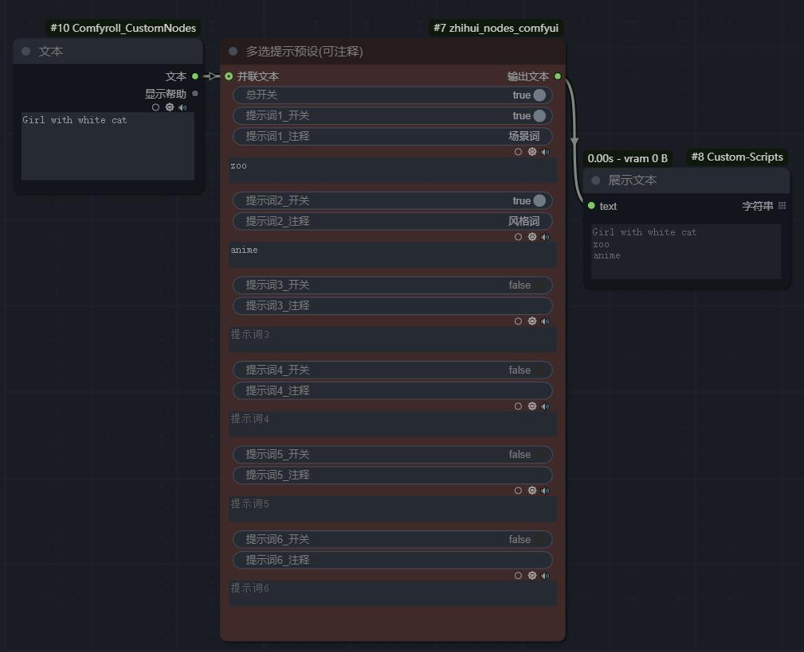
</a>
</div></td>
</tr>
<tr>
<td><b>触发词合并器</b><br><b>Trigger Word Merger</b><br><code>TriggerWordMerger</code></td>
<td>将特定的触发词（Trigger Words）与主文本智能合并，并支持权重控制（例如 <code>(word:1.5)</code>）。适用于添加模型特定的触发词或风格词，并精确控制其影响强度。<br>Intelligently merges specific trigger words with main text, supporting weight control (e.g., <code>(word:1.5)</code>). Suitable for adding model-specific trigger words or style words with precise control over their influence strength.

<br>
<div align="left">
<a href="images/触发词合并器.jpg" target="_blank">
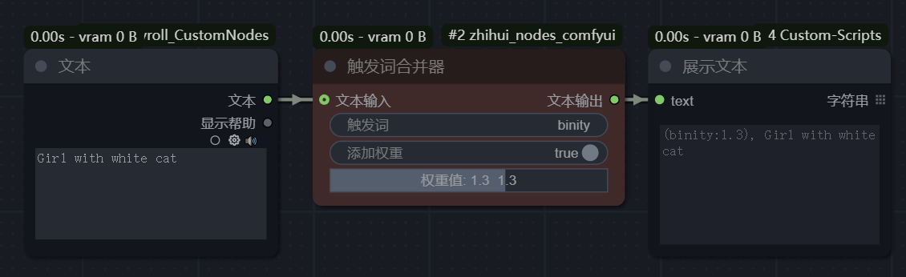
</a>
</div>
</td>
</tr>
<tr>
<td><b>系统引导词加载器</b><br><b>System Prompt Loader</b><br><code>SystemPromptLoader</code></td>
<td>从预设文件夹动态加载系统级引导词（System Prompt），并可选择性地与用户输入合并。适合管理和应用复杂的系统提示模板，提高生成结果的一致性和质量。<br>Dynamically loads system-level prompts from preset folders and can optionally merge with user input. Suitable for managing and applying complex system prompt templates to improve consistency and quality of generated results.<br><br>
<div align="left">
<a href="images/系统引导词加载器.jpg" target="_blank">
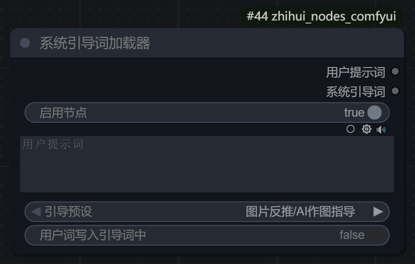
</a>
</div>
</td>
</tr>
<tr>
<td><b>系统引导词加载器(基础版)</b><br><b>System Prompt Loader (Basic)</b><br><code>SystemPromptLoaderBase</code></td>
<td>从预设文件夹动态加载系统级引导词（System Prompt），简化了节点功能，适合需要纯系统引导词的场景。<br>Dynamically loads system-level prompts from preset folders with simplified node functionality, suitable for scenarios requiring pure system prompts.<br><br>
<div align="left">
<a href="images/系统引导词加载器基础版.jpg" target="_blank">
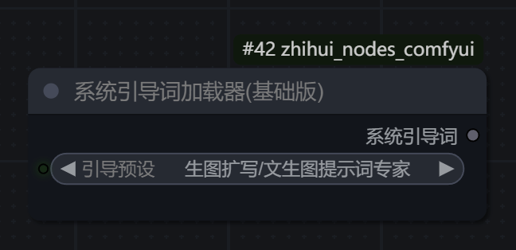
</a>
</div>
</td>
</tr>
<tr>
<td><b>额外选项列表</b><br><b>Extra Options</b><br><code>ExtraOptions</code></td>
<td>一个通用的额外选项列表，类似于 JoyCaption 的设计，设有总开关和独立的引导词输入框。适合添加辅助提示或控制参数，增强工作流的灵活性。<br>A universal extra options list similar to JoyCaption's design, with master switch and independent prompt input boxes. Suitable for adding auxiliary prompts or control parameters to enhance workflow flexibility.<br><br>
<div align="left">
<a href="images/额外引导选项（通用）.jpg" target="_blank">
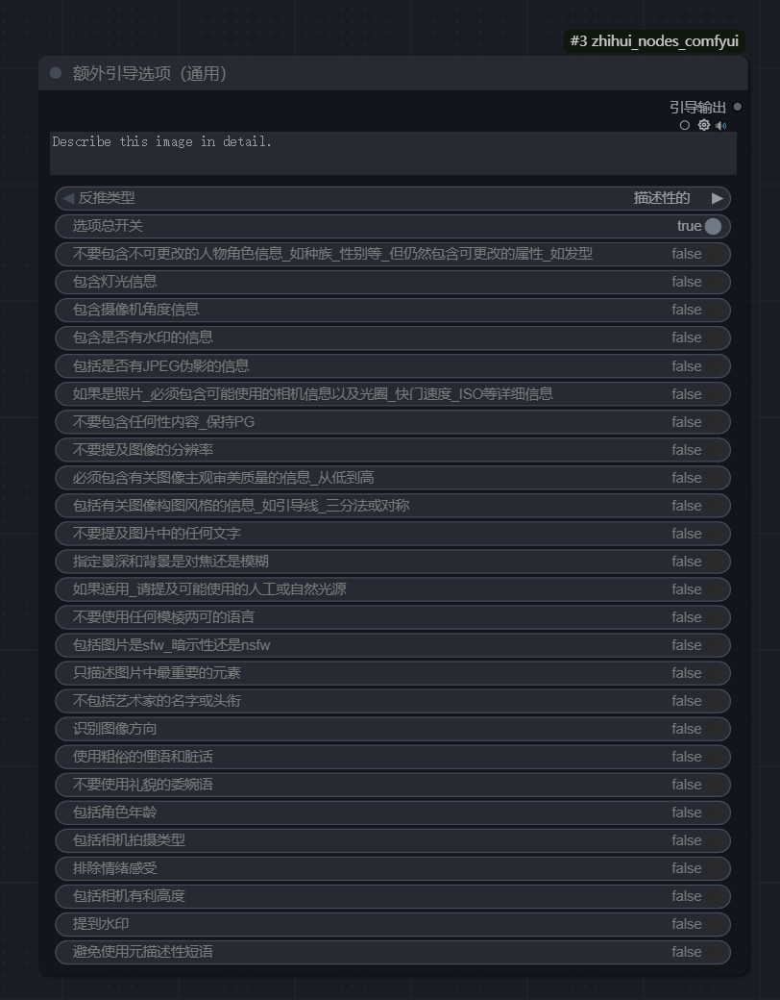
</a>
</div></td>
</tr>
</table>

### 🖼️ 图像处理类节点 | Image Processing Nodes

<table>
<tr>
<th width="30%">节点名称 | Node Name</th>
<th>功能描述 | Function Description</th>
</tr>
<tr>
<td><b>图像宽高比设置</b><br><b>Image Aspect Ratio</b><br><code>ImageAspectRatio</code></td>
<td>智能图像宽高比设置工具，支持多种预设模式和自定义尺寸配置。<br>Intelligent image aspect ratio setting tool, supporting multiple preset modes and custom size configurations.

<b>特点 | Features</b>：
- <b>多预设支持 | Multi-preset Support</b>：内置Qwen、Flux、Wan、SDXL等主流模型的专用宽高比预设<br>Built-in dedicated aspect ratio presets for mainstream models like Qwen, Flux, Wan, SDXL

- <b>自定义模式 | Custom Mode</b>：支持完全自定义的宽度和高度设置<br>Supports fully customizable width and height settings
- <b>宽高比锁定 | Aspect Ratio Lock</b>：提供宽高比锁定功能，修改一个维度时自动调整另一个维度<br>Provides aspect ratio lock function, automatically adjusts the other dimension when modifying one
- <b>智能切换 | Smart Switching</b>：根据选择的预设模式自动显示对应的宽高比选项<br>Automatically displays corresponding aspect ratio options based on selected preset mode

<br>
<div align="left">
<a href="images/图像宽高比设置1.jpg" target="_blank">
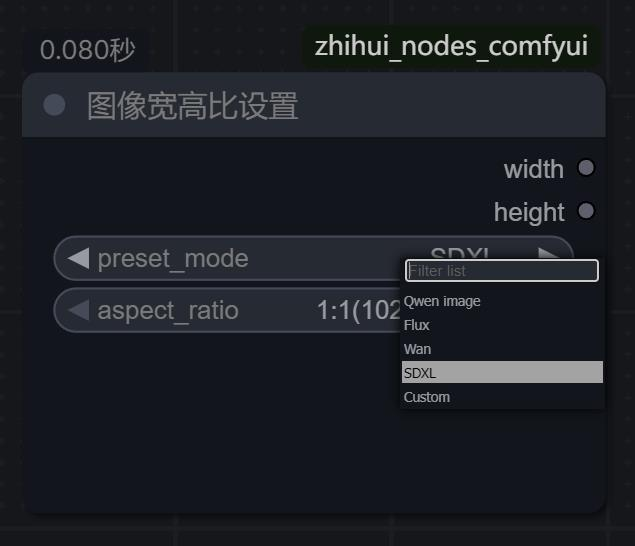
</a>
<a href="images/图像宽高比设置2.jpg" target="_blank">
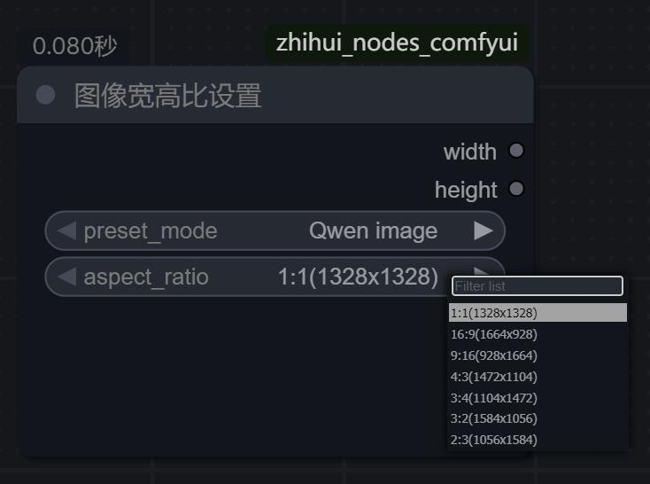
</a>
<a href="images/图像宽高比设置3.jpg" target="_blank">
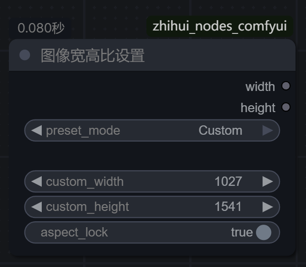
</a>
</div>
</td>
</tr>
<tr>
<td><b>图像缩放器</b><br><b>Image Scaler</b><br><code>ImageScaler</code></td>
<td>提供多种插值算法对图像进行缩放，并可选择保持原始宽高比。支持高质量的图像尺寸调整，适用于预处理或后处理阶段。<br>Provides multiple interpolation algorithms for image scaling with optional original aspect ratio preservation. Supports high-quality image size adjustment, suitable for preprocessing or post-processing stages.

<br>
<div align="left">
<a href="images/图像缩放器.jpg" target="_blank">
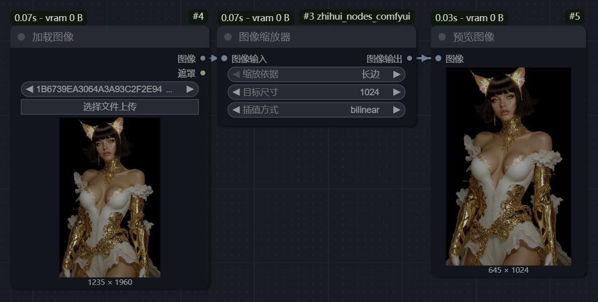
</a>
</div>
</td>
</tr>
<tr>
<td><b>颜色移除</b><br><b>Color Removal</b><br><code>ColorRemoval</code></td>
<td>从图像中移除彩色，输出灰度图像。适用于创建黑白效果或作为特定图像处理流程的预处理步骤。<br>Removes color from images and outputs grayscale images. Suitable for creating black and white effects or as a preprocessing step for specific image processing workflows.<br><br>
<a href="images/颜色移除节点展示.jpg" target="_blank">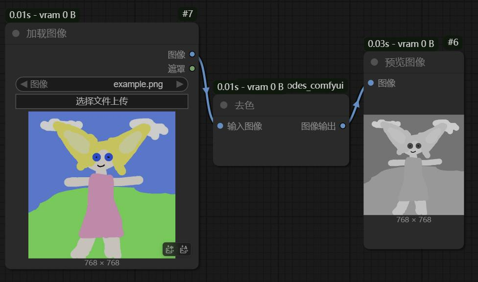</a></td>
</tr>
<tr>
<td><b>图像预览/对比</b><br><b>Preview or Compare Images</b><br><code>PreviewOrCompareImages</code></td>
<td>多功能图像预览和对比节点，支持单张图像预览或两张图像的并排对比显示。image_1为必需输入，image_2为可选输入，当提供两张图像时自动启用对比模式。<br>Multi-functional image preview and comparison node that supports single image preview or side-by-side comparison of two images. image_1 is required input, image_2 is optional input, automatically enables comparison mode when two images are provided.

<b>特点 | Features</b>：
- <b>双模式智能切换 | Dual-mode Smart Switching</b>：根据输入单图或双图自动切换预览或对比模式<br>Automatically switches between preview or comparison mode based on single or dual image inputs
- <b>交互式对比 | Interactive Comparison</b>：鼠标悬停时显示滑动分割线进行直观对比<br>Shows sliding divider for intuitive comparison when mouse hovers over the node

<br>
<div align="left">
<a href="images/图像对比.jpg" target="_blank">
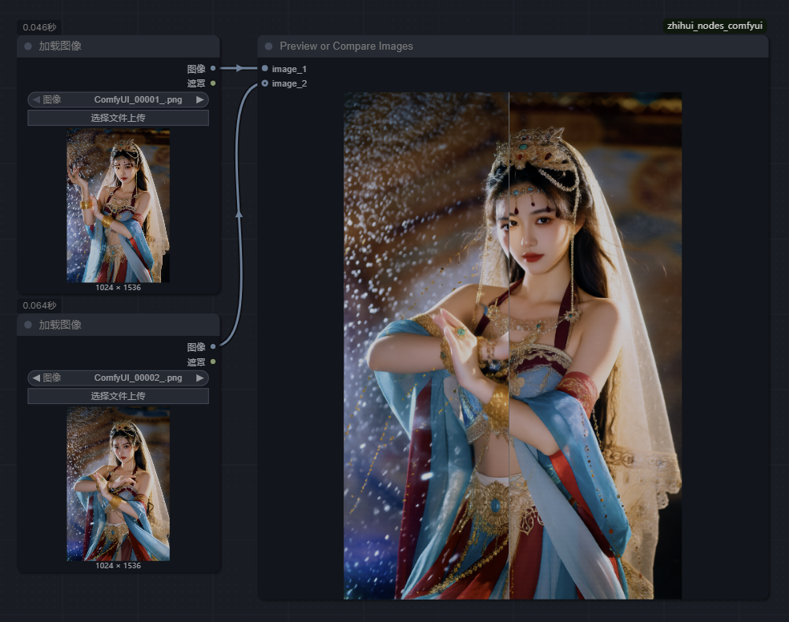
</a>
</div>
</td>
</tr>
</table>

### 🎞️ 电影后期处理类节点 | Film Post-processing Nodes

<table>
<tr>
<th width="30%">节点名称 | Node Name</th>
<th>功能描述 | Function Description</th>
</tr>
<tr>
<td><b>胶片颗粒效果</b><br><b>Film Grain</b><br><code>FilmGrain</code></td>
<td>

为图像添加逼真的胶片颗粒效果，营造经典胶片质感。<br>Adds realistic film grain effects to images, creating classic film texture.
- <b>双分布模式</b>：支持高斯分布（自然胶片噪点）和平均分布（数字均匀噪点）<br><b>Dual Distribution Modes</b>: Supports Gaussian distribution (natural film noise) and uniform distribution (digital uniform noise)

- <b>饱和度混合</b>：独立控制彩色/单色颗粒比例，实现从彩色胶片到黑白胶片的平滑过渡<br><b>Saturation Blending</b>: Independent control of color/monochrome grain ratio, achieving smooth transition from color film to black and white film

<br>
<div align="left">
<a href="images/胶片颗粒.jpg" target="_blank">
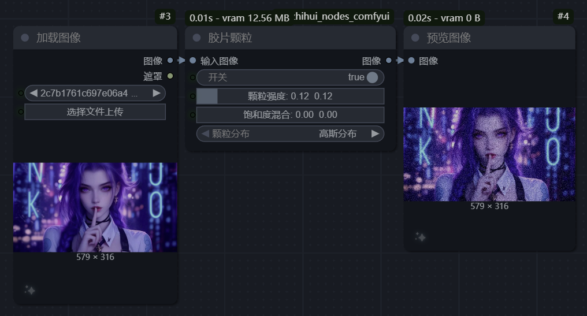
</a>
</div>
</td>
</tr>

<tr>
<td><b>拉普拉斯锐化</b><br><b>Laplacian Sharpen</b><br><code>LaplacianSharpen</code></td>
<td>
基于拉普拉斯算子的边缘锐化工具，通过二阶微分检测图像边缘并增强细节，适合风景和人像的细节增强。<br>Edge sharpening tool based on Laplacian operator, detects image edges through second-order derivatives and enhances details, suitable for landscape and portrait detail enhancement.

<br>
<div align="left">
<a href="images/拉普拉斯锐化.jpg" target="_blank">
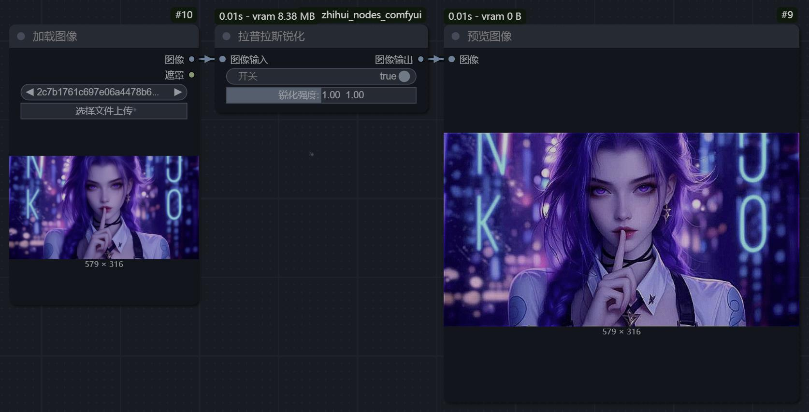
</a>
</div>
</td>
</tr>
<tr>

<td><b>索贝尔锐化</b><br><b>Sobel Sharpen</b><br><code>SobelSharpen</code></td>
<td>
采用索贝尔算子的方向性锐化工具，通过梯度计算同时增强水平和垂直边缘，适合需要强调纹理的场景。<br>Directional sharpening tool using Sobel operator, enhances both horizontal and vertical edges through gradient calculation, suitable for scenes requiring texture emphasis.

<br>
<div align="left">
<a href="images/索贝尔锐化.jpg" target="_blank">
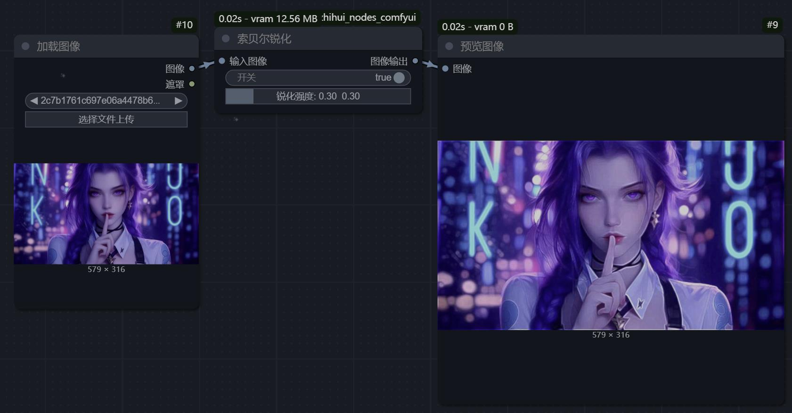
</a>
</div>
</td>
</tr>
<tr>
<td><b>USM锐化</b><br><b>USM Sharpen</b><br><code>USMSharpen</code></td>
<td>
使用经典USM锐化技术来增强细节，对目标图像进行自然的锐化处理。<br>Uses classic USM sharpening technology to enhance details, providing natural sharpening processing for target images.

<br>
<div align="left">
<a href="images/USM锐化.jpg" target="_blank">
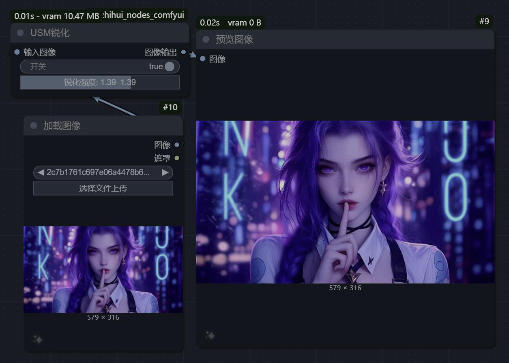
</a>
</div>
</td>
</tr>
<tr>
<td><b>色彩匹配</b><br><b>Color Match to Reference</b><br><code>ColorMatchToReference</code></td>
<td>
智能色彩匹配工具，可将参考图像的色调风格应用到目标图像，实现专业级色彩统一。<br>Intelligent color matching tool that applies the color style of reference images to target images, achieving professional-level color unification.

<br>
<div align="left">
<a href="images/颜色匹配.jpg" target="_blank">
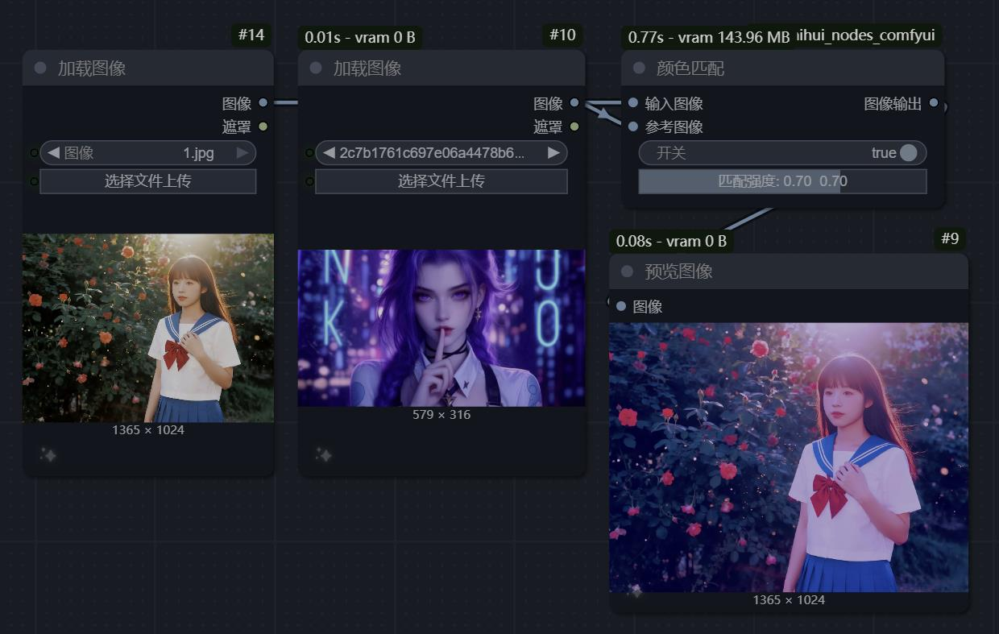
</a>
</div>
</td>
</tr>
</table>

### ⚙️ 逻辑与工具类节点 | Logic and Utility Nodes

<table>
<tr>
<th width="30%">节点名称 | Node Name</th>
<th>功能描述 | Function Description</th>
</tr>
<tr>
<td><b>Latent切换器(双模式)</b><br><b>Latent Switch Dual Mode</b><br><code>LatentSwitch</code></td>
<td>支持3个Latent输入的双模式切换器，可通过下拉菜单手动选择输出，或启用自动模式智能检测单个有效输入。<br>Supports 3 Latent inputs with dual-mode switching, can manually select output through dropdown menu, or enable auto mode to intelligently detect single valid input.

<br>
<div align="left">
<a href="images/Latent切换器.jpg" target="_blank">
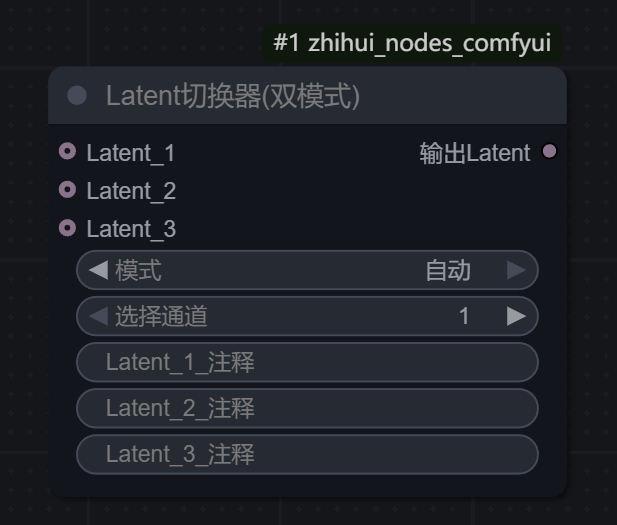
</a>
</div>
</td>
</tr>
<tr>
<td><b>文本切换器(双模式)</b><br><b>Text Switch Dual Mode</b><br><code>TextSwitchDualMode</code></td>
<td>支持4个文本输入的双模式切换器，可通过下拉菜单手动选择输出，或启用自动模式智能检测单个有效输入。便于在不同版本的提示词之间快速切换，进行对比实验。<br>Supports 4 text inputs with dual-mode switching, can manually select output through dropdown menu, or enable auto mode to intelligently detect single valid input. Convenient for quickly switching between different versions of prompts for comparison experiments.

<br>
<div align="left">
<a href="images/文本切换器.jpg" target="_blank">
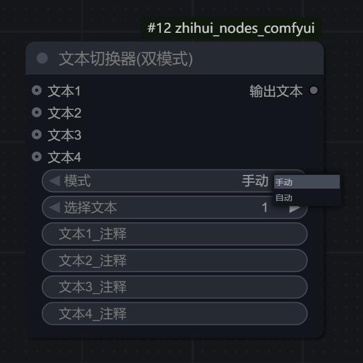
</a>
</div>
</td>
</tr>
<tr>
<td><b>图像切换器(双模式)</b><br><b>Image Switch Dual Mode</b><br><code>ImageSwitchDualMode</code></td>
<td>支持在2个或4个图像输入之间进行切换的双模式切换器，可通过下拉菜单手动选择输出，或启用自动模式智能检测单个有效输入。便于比较不同生成结果或应用不同的图像处理路径。<br>Supports switching between 2 or 4 image inputs with dual-mode switching, can manually select output through dropdown menu, or enable auto mode to intelligently detect single valid input. Convenient for comparing different generation results or applying different image processing paths.

<br>
<div align="left">
<a href="images/图像切换器.jpg" target="_blank">
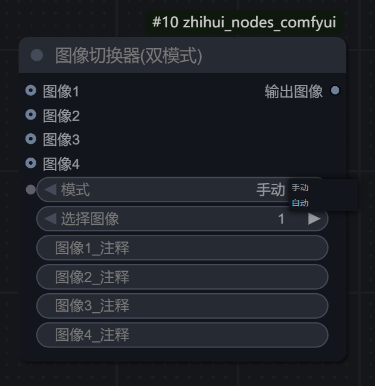
</a>
</div>
</td>
</tr>
<tr>
<td><b>优先级图像切换</b><br><b>Priority Image Switch</b><br><code>PriorityImageSwitch</code></td>
<td>智能优先级图像切换节点，当同时接入图像A和图像B端口时，优先输出B端口的内容；如果B端口无输入，则输出图像A端口的内容；如果两个端口都无输入，则弹出提示要求至少连接一个输入端口。<br>Intelligent priority image switching node. When both image A and image B ports are connected, it prioritizes output from port B; if port B has no input, it outputs from image A port; if both ports have no input, it prompts to connect at least one input port.

<b>特点 | Features</b>：
- <b>优先级控制 | Priority Control</b>：图像B端口优先级高于图像A端口<br>Image B port has higher priority than image A port
- <b>智能切换 | Smart Switching</b>：自动检测输入状态，无缝切换输出，减少手动切换操作<br>Automatically detects input status, seamlessly switches output, reducing manual switching operations

<br>
<div align="left">
<a href="images/优先级图像切换.jpg" target="_blank">
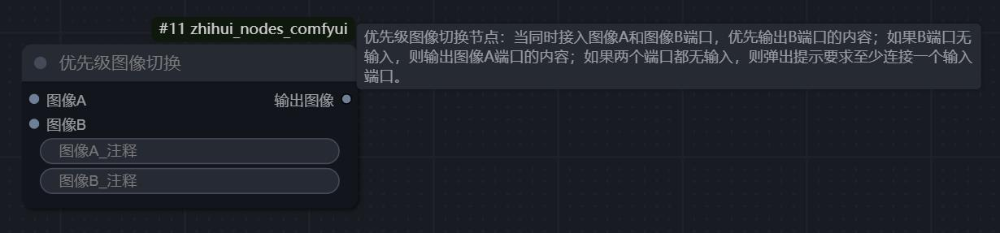
</a>
</div></td>
</tr>
<tr>
<td><b>百度翻译</b><br><b>Baidu Translate</b><br><code>BaiduTranslate</code></td>
<td>

提供在线翻译服务，支持中英文互译和源语言自动检测。<br>Provides online translation services, supporting bidirectional Chinese-English translation and automatic source language detection.

<b>密钥加载 | Key Loading</b>：
- <b>明文加载 | Plain Text Loading</b>：直接在节点中输入 <code>APP_ID</code> 和 <code>API_KEY</code><br>Directly input <code>APP_ID</code> and <code>API_KEY</code> in the node

- <b>后台加载 | Background Loading</b>：从配置文件读取密钥，保护隐私安全<br>Read keys from configuration file to protect privacy and security

<b>注意 | Note</b>：
- 需在<a href="https://api.fanyi.baidu.com/">百度翻译开放平台</a>注册并获取密钥<br>Need to register and obtain keys at <a href="https://api.fanyi.baidu.com/">Baidu Translate Open Platform</a>

- 使用此节点需要网络连接<br>Network connection required for this node
- 后台加载方式需要先修改配置文件"baidu_translate_config.json"后重启ComfyUI。（配置文件路径：...\custom_nodes\zhihui_nodes_comfyui\Nodes\Translate）<br>Background loading requires modifying the configuration file "baidu_translate_config.json" before restarting ComfyUI. (Config file path: ...\custom_nodes\zhihui_nodes_comfyui\Nodes\Translate)

<div align="left">
<a href="images/百度翻译.jpg" target="_blank">
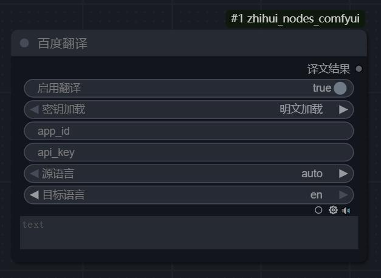
</a>
</div>
</td>
</tr>
<tr>
<td><b>免费在线翻译</b><br><b>Free Online Translate</b><br><code>FreeTranslate</code></td>
<td>

免费在线翻译服务，支持中英文双向翻译和自动语言检测。<br>Free online translation service supporting bidirectional Chinese-English translation and automatic language detection.

<b>特点 | Features</b>：
- <b>免费使用 | Free to Use</b>：无需注册或API密钥，开箱即用<br>No registration or API key required, ready to use out of the box

- <b>多模型支持 | Multi-model Support</b>：提供11种AI模型选择（OpenAI、Claude、DeepSeek、Gemini等）<br>Provides 11 AI model options (OpenAI, Claude, DeepSeek, Gemini, etc.)
- <b>注意 | Note</b>：使用此节点需要网络连接<br>Network connection required for this node

<div align="left">
<a href="images/中英文翻译器.jpg" target="_blank">
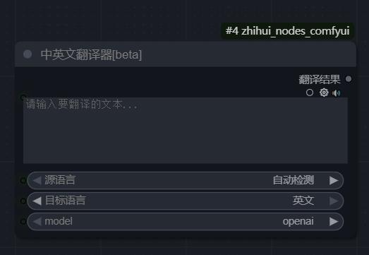
</a>
</div>
</td>
</tr>
<tr>
<td><b>腾讯翻译</b><br><b>Tencent Translater</b><br><code>TencentTranslater</code></td>
<td>

使用腾讯云翻译API进行文本翻译，支持自动语言检测和中英文互译。<br>Uses Tencent Cloud Translation API for text translation, supporting automatic language detection and bidirectional Chinese-English translation.

<b>特点 | Features</b>：
- <b>高质量翻译 | High-Quality Translation</b>：基于腾讯云专业翻译引擎，提供准确可靠的翻译结果<br>Based on Tencent Cloud professional translation engine, providing accurate and reliable translation results

- <b>简单易用 | Easy to Use</b>：无需配置API密钥，开箱即用<br>No API key configuration required, ready to use out of the box

- <b>注意 | Note</b>：使用此节点需要网络连接<br>Network connection required for this node

<div align="left">
<a href="images/腾讯翻译.jpg" target="_blank">
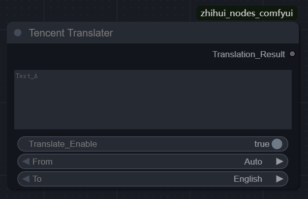
</a>
</div>
</td>
</tr>
<tr>
<td><b>本地文件画廊</b><br><b>Local File Gallery</b><br><code>LocalFileGallery</code></td>
<td>

本地文件浏览和选择工具，提供直观的文件管理界面，支持图片和文本文件的预览与选择。<br>Local file browsing and selection tool, providing an intuitive file management interface, supporting preview and selection of image and text files.

<b>支持格式 | Supported Formats</b>：
- <b>图片格式 | Image Formats</b>：jpg, jpeg, png, bmp, gif, webp
- <b>文本格式 | Text Formats</b>：txt, json, js

<b>特点 | Features</b>：
- <b>可视化界面 | Visual Interface</b>：提供友好的文件浏览器界面<br>Provides a user-friendly file browser interface
- <b>缩略图支持 | Thumbnail Support</b>：快速预览图片内容<br>Quick preview of image content

<div align="left">
<a href="images/本地文件画廊.jpg" target="_blank">
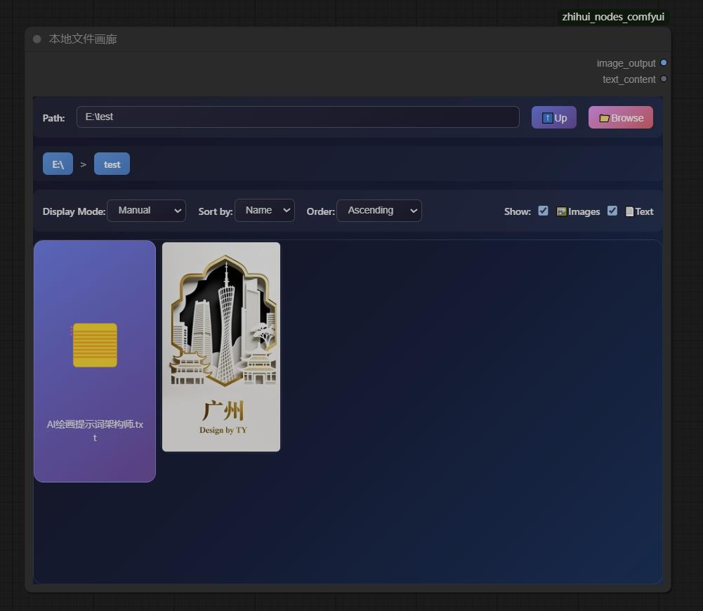
</a>
</div>
</td>
</tr>
<tr>
<td><b>🏷️TAG标签选择器</b><br><b>Tag Selector</b><br><code>TagSelector</code></td>
<td>

专业的可视化标签选择工具，提供直观的多级分类导航界面，支持海量标签的快速选择和管理。<br>Professional visual tag selection tool, providing an intuitive multi-level category navigation interface, supporting rapid selection and management of massive tags.

<b>特点 | Features</b>：
- <b>多级分类导航 | Multi-level Category Navigation</b>：支持三级/四级分类结构，清晰的层级导航<br>Supports 3/4-level category structure with clear hierarchical navigation
- <b>可视化标签选择 | Visual Tag Selection</b>：直观的标签展示界面，支持中英文双语显示<br>Intuitive tag display interface with bilingual Chinese-English support
- <b>已选标签管理 | Selected Tags Management</b>：实时显示已选标签数量和列表，支持快速移除<br>Real-time display of selected tag count and list with quick removal support

<b>使用场景 | Use Cases</b>：
- 提示词标签的快速选择和组合<br>Quick selection and combination of prompt tags


</td>
</tr>
</table>

---

## 🚀 安装方式 | Installation

### 📦 通过 ComfyUI Manager 安装（推荐） | Install via ComfyUI Manager (Recommended)

1. 安装 [ComfyUI Manager](https://github.com/ltdrdata/ComfyUI-Manager)<br>Install [ComfyUI Manager](https://github.com/ltdrdata/ComfyUI-Manager)

2. 在 Manager 菜单中选择 "Install Custom Nodes"<br>Select "Install Custom Nodes" in Manager menu
3. 搜索 `zhihui_nodes_comfyui`（暂未支持） ，或通过 Git URL 进行安装：<br>Search for `zhihui_nodes_comfyui` (not yet supported), or install via Git URL:
   ```
   https://github.com/ZhiHui6/zhihui_nodes_comfyui.git
   ```
4. 点击 "Install" 按钮并等待安装完成<br>Click "Install" button and wait for installation to complete
5. 重启 ComfyUI，即可在节点菜单中找到新添加的节点<br>Restart ComfyUI, and you can find the newly added nodes in the node menu

### 🔧 手动安装 | Manual Installation

1. 下载本仓库的 ZIP 文件或通过 Git 克隆：<br>Download the ZIP file of this repository or clone via Git:
   ```bash
   git clone https://github.com/ZhiHui6/zhihui_nodes_comfyui.git
   ```
   
2. 将整个 `zhihui_nodes_comfyui` 文件夹解压或复制到 ComfyUI 的 `custom_nodes` 目录下<br>Extract or copy the entire `zhihui_nodes_comfyui` folder to ComfyUI's `custom_nodes` directory
3. 重启 ComfyUI<br>Restart ComfyUI

---

### 📋 依赖项 | Dependencies

本节点集大部分功能无需额外依赖，开箱即用。部分在线功能（如翻译、提示词优化）需要网络连接。<br>Most functions of this node collection require no additional dependencies and are ready to use out of the box. Some online functions (such as translation and prompt optimization) require network connection.

如需手动安装依赖，可执行：<br>If you need to manually install dependencies, you can execute:

```bash
pip install -r requirements.txt
```
## 🤝 贡献指南 | Contribution Guide

我们欢迎各种形式的贡献，包括但不限于：<br>We welcome all forms of contributions, including but not limited to:
<div align="left">
[🔴报告问题和提出建议 ] | [💡提交功能请求] | [📚改进文档] | [💻提交代码贡献]<br>

[Report issues and suggestions] | [Submit feature requests] | [Improve documentation] | [Submit code contributions]
</div>

如果您有任何想法或建议，请随时提出 Issue 或 Pull Request。<br>If you have any ideas or suggestions, please feel free to submit an Issue or Pull Request.