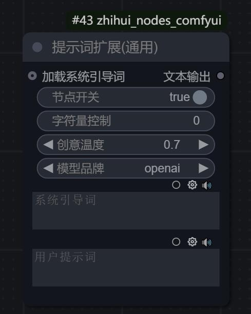
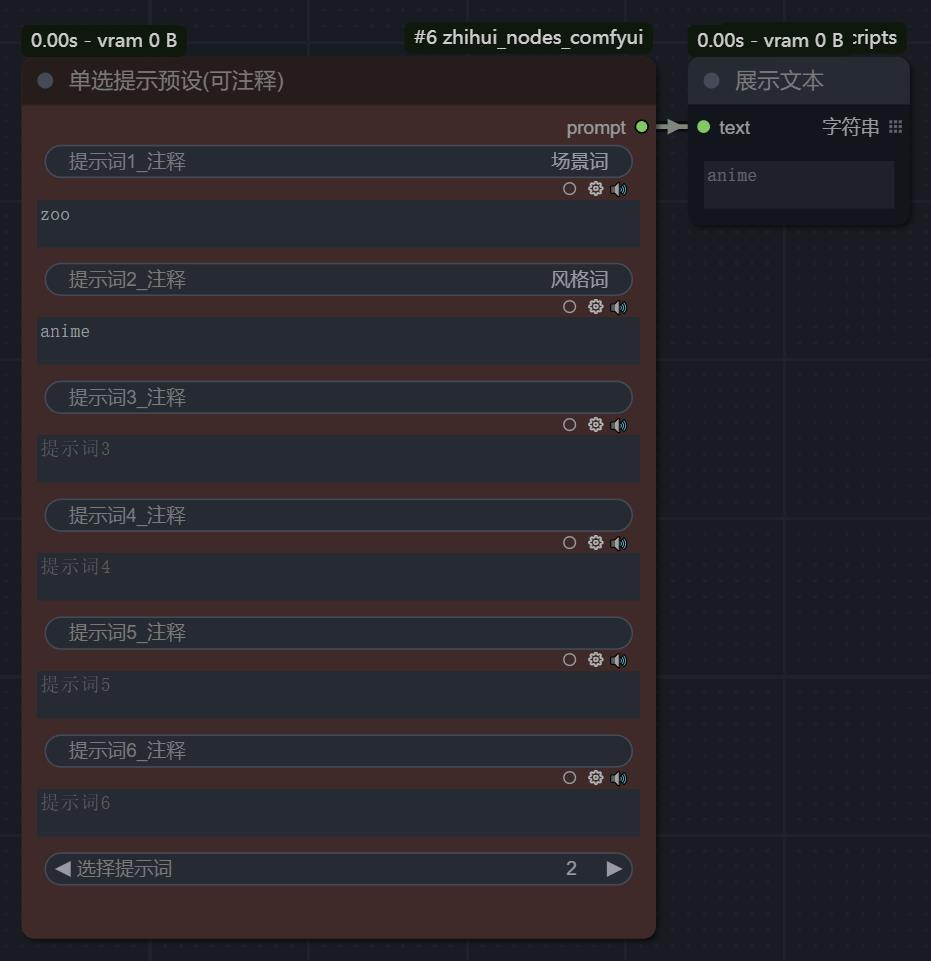
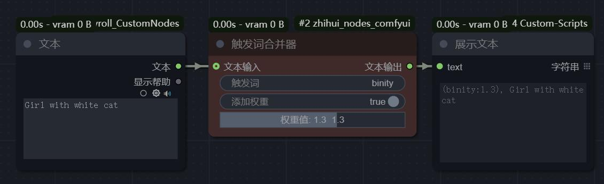
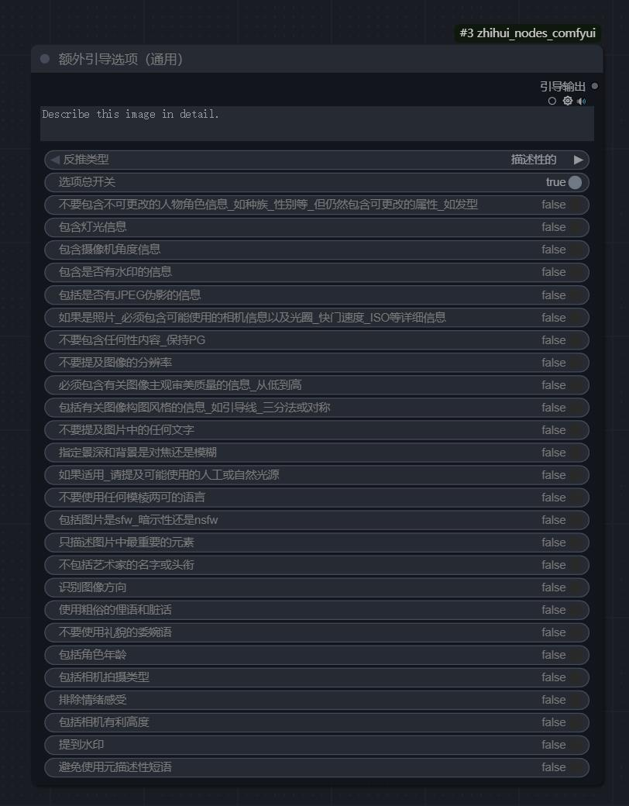
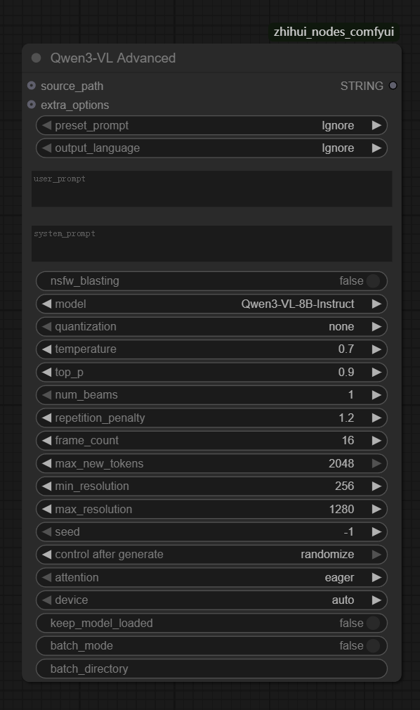

### [[English Document]](README_EN.md)

# 🎨 潪AI ComfyUI 节点包 

最新版本：`v1.0.4`（2026-1-21），完整更新日志：查看<a href="CHANGELOG.md">`CHANGELOG.md`</a>

## 📖 项目介绍

这是一个由<span style="color: red;"> **Binity** </span>精心创建的 ComfyUI 自定义节点工具合集，旨在为用户提供一系列实用、高效的节点，以增强和扩展 ComfyUI 的功能。本节点集包含30+功能节点，涵盖文本处理、提示词优化、图像处理、翻译工具、音乐创作辅助、Latent处理等多个方面，为您的 AI 创作提供全方位支持。

***如果这个项目对您有帮助，请给我们一个⭐Star！您的支持是我们持续改进的动力。***

## ✨ 主要特点

### 🌍 **中文本地化支持**
提供专门的中文汉化文件，配合 ComfyUI-DD-Translation 扩展使用，让中文用户能够更便捷地使用各个节点功能。详细说明请参考 <a href="doc/Localization_Guide.md">Localization_Guide.md</a>。

### **核心功能特色**

- 🔄 **多引擎翻译节点**：集成百度、腾讯、有道、谷歌、免费在线等5大翻译引擎，支持中英日韩等多语种互译，可自动识别输入语言并一键切换最优引擎。

- 📝 **全面文本处理**：提供多行文本编辑、文本合并分离、内容提取修改、语言过滤等5类文本操作节点。

- 🎯 **智能提示词系统**：标签选择器、Kontext预设增强版、摄影提示词生成器、万相视频提示词生成器等专业的提示词生成工具。

- 🖼️ **实用图像工具**：支持多算法图像缩放、智能切换、颜色移除等等。

## ⭐ 明星节点

🔥 **<span style="color: #FF6B35; font-weight: bold; font-size: 1.1em;">以下是本节点集中重点推荐的特色节点：</span>**

<table>
<tr>
<th width="30%">节点名称</th>
<th width="19%">类别</th>
<th width="51%">核心功能</th>
</tr>

<tr>
<td><b>TagSelector</b><br><b>标签选择器</b><br><code>TagSelector</code></td>
<td>提示词处理</td>
<td>新一代智能标签管理系统，提供可视化标签选择界面，支持自定义标签管理和智能搜索功能。分类丰富，涵盖画质、摄影、艺术风格等众多专业标签。</td>
</tr>

<tr>
<td><b>Qwen3-VL高级版</b><br><code>Qwen3VLAdv</code></td>
<td>AI视觉理解</td>
<td>通过Qwen3-VL视觉识别大模型，提供专业级内容描述、场景理解等核心功能，实现图像/视频智能分析。支持NSFW破限分析，具备4bit/8bit量化加速和批量处理能力。</td>
</tr>

<tr>
<td><b>万相视频提示词生成器</b><br><code>WanPromptGenerator</code></td>
<td>提示词处理</td>
<td>基于万相2.2官方文档编写的全能型提示词生成器，支持自定义和预设两种组合方法，涵盖运镜、场景、光线、构图等17个维度的专业视频提示词生成。</td>
</tr>

<tr>
<td><b>Kontext预设增强版</b><br><code>KontextPresetsPlus</code></td>
<td>提示词处理</td>
<td>内置20+创意预设的Kontext图像编辑预设工具，支持用户自定义预设扩展，集成多种LLM模型免费在线智能扩写。</td>
</tr>

<tr>
<td><b>摄影提示词生成器</b><br><code>PhotographPromptGenerator</code></td>
<td>提示词处理</td>
<td>专业摄影风格提示词生成器，涵盖人物、场景、镜头、光线、服装等16个维度。支持输出模式切换（标签组合/模板文本），集成AI扩写功能。配有用户自定义选项扩展和模板编辑助手界面。</td>
</tr>
</table>

💡 **使用建议**：新用户建议从 **标签选择器** 或 **摄影提示词生成器** 开始体验，快速提升您的创作灵感和效率。

---

## 🛠️ 节点功能说明

本节点集包含众多功能各异的节点，分为以下几个主要类别：

### 📝 文本处理类节点

<table>
<tr>
<th width="30%">节点名称</th>
<th>功能描述</th>
</tr>
<tr>
<td><b>多行文本</b><br><code>MultiLineTextNode</code></td>
<td>提供一个支持多行输入的文本框，并带注释功能。

<br>
<div align="left">
<a href="images/多行文本.jpg" target="_blank">

</a>
</div></td>
</tr>
<tr>
<td><b>优先级文本切换</b><br><code>PriorityTextSwitch</code></td>
<td>优先级文本切换节点：当同时接入文本A和文本B端口时，优先输出B端口；如果B端口为空或未连接，则输出文本A端口；如果两个端口都为空，则返回空字符串。

<b>特点</b>：
- <b>优先级控制</b>：文本B端口优先级高于文本A端口
- <b>智能切换</b>：自动检测输入状态，空值时回退到A或输出空文本

<br>
<div align="left">
<a href="images/Priority Text Switch.jpg" target="_blank">

</a>
</div>
</td>
</tr>
<td><b>提示词合并器(可注释)</b><br><code>TextCombinerNode</code></td>
<td>合并两个文本输入，并可通过独立的开关控制每个文本的输出，并带注释功能。可用于动态组合不同的提示词部分，灵活构建完整提示。

<br>
<div align="left">
<a href="images/提示词合并器.jpg" target="_blank">

</a>
</div></td>
</tr>
<tr>
<td><b>文本合并器</b><br><code>TextMergerNode</code></td>
<td>将多个文本输入合并为一个输出文本，支持灵活配置输入端口数量。<b>user_text</b> 输入框内容优先显示在最前面，后续通过 <b>inputcount</b> 滑块控制 <b>text_2</b> 到 <b>text_N</b> 端口数量。所有非空文本按顺序用分隔符连接，适用于批量合并多个提示词或文本片段。

<br>
<div align="left">
<a href="images/Text Merger Node.png" target="_blank">

</a>
</div></td>
</tr>
<tr>
<td><b>文本修改器</b><br><code>TextModifier</code></td>
<td>根据指定的起始和结束标记提取文本内容，并自动去除多余的空白字符。适合从复杂文本中提取特定部分，或进行格式清理。

<br>
<div align="left">
<a href="images/Text Modifier.jpg" target="_blank">

</a>
</div></td>
</tr>
<tr>
<td><b>中英文本提取器</b><br><code>TextExtractor</code></td>
<td>从混合文本中提取纯中文或纯英文字符，支持标点和数字的提取，并自动清理格式。对于处理双语提示词或分离不同语言内容非常有用。<br><br>
<div align="left">
<a href="images/中英文本提取器.jpg" target="_blank">

</a>
</div></td>
</tr>

<tr>
<td><b>提示词扩展(通用)</b><br><code>TextExpander</code></td>
<td>

使用多种LLM模型对输入文本进行智能扩写和创意增强，支持字符量控制和自定义系统引导词。

<b>特点</b>：
- <b>多模型支持</b>：支持claude、deepseek、gemini、openai、mistral、qwen-coder、llama、sur、unity、searchgpt、evil等11种AI模型
- <b>字符量控制</b>：可精确控制输出文本的字符数量，确保生成内容符合要求
- <b>创意温度调节</b>：通过温度参数控制生成内容的创意程度（0.1-2.0）
- <b>系统引导词</b>：支持自定义系统引导词，引导AI生成特定风格的内容
- <b>灵活输入</b>：支持直接输入系统引导词或通过外部节点加载

<div align="left">
<a href="images/提示词扩展(通用).jpg" target="_blank">

</a>
</div>
</td>
</tr>
<tr>
<td><b>文本显示器</b><br><code>ShowText</code></td>
<td>用于在ComfyUI界面中显示文本内容的节点，支持多行文本展示，可实时显示上游节点传递的文本信息，便于调试和查看中间结果。

<br>
<div align="left">
<a href="images/文本显示器.jpg" target="_blank">

</a>
</div>
</td>
</tr>
<tr>
<td><b>文本编辑器（继续运行）</b><br><code>TextEditorWithContinue</code></td>
<td>交互式文本编辑节点，暂停工作流执行并提供可编辑文本区域，用户可在运行时修改文本内容，点击继续按钮恢复工作流执行。

<b>特点</b>：
- <b>工作流暂停</b>：自动暂停工作流执行，等待用户交互
- <b>实时编辑</b>：提供可编辑文本区域，支持多行文本编辑
- <b>手动同步</b>：编辑后需手动点击同步按钮更新内容

<b>使用场景</b>：
- 工作流中需要人工干预和文本调整的场景
- 提示词的实时优化和调试

<br>
<div align="left">
<a href="images/Text Editor with Continue.jpg" target="_blank">

</a>
</div>
</td>
</tr>
</table>

### 🎯 提示词处理类节点

<table>
<tr>
<th width="30%">节点名称</th>
<th>功能描述</th>
</tr>
<tr>
<td><b>Kontext预设基础版</b><br><code>LoadKontextPresetsBasic</code></td>
<td>提供专业的图像变换预设库，包含13项专业预设。为图像生成提供风格化指导，帮助用户快速应用常见的艺术风格和效果。

<br>
<div align="left">
<a href="images/Kontext预设集基础版.jpg" target="_blank">

</a>
</div>
</td>
</tr>
<tr>
<td><b>Kontext预设增强版</b><br><code>KontextPresetsPlus</code></td>
<td>

提供专业的图像变换预设，内置免费在线扩写功能，支持用户自定义预设，为图像编辑提供创意指导。

<b>特点</b>：
- <b>丰富预设库</b>：包含20余项专业预设
- <b>双预设库</b>：支持默认预设和用户自定义预设，用户可自由新增更多创意预设，通过分类标识区分预设来源。<a href="doc/Kontext_Presets_User_File_Instructions.md" style="font-weight:bold;color:yellow;">用户预设使用说明</a>
- <b>智能扩写</b>：支持多种LLM模型对预设内容进行创意扩写
- <b>灵活输出</b>：支持输出原始预设内容、完整信息或AI扩写后的内容

<div align="left">
<a href="images/Kontext预设增强版节点展示.jpg" target="_blank">

</a>
<a href="images/Kontext预设增强版效果预览.jpg" target="_blank">

</a>
</div>
</td>
</tr>
<tr>
<td><b>摄影提示词生成器</b><br><code>PhotographPromptGenerator</code></td>
<td>

根据预设的摄影要素（如相机、镜头、光照、场景等）组合生成专业的摄影风格提示词。

<b>特点</b>：
- 支持从自定义文本文件加载选项，灵活扩展
- 支持随机选择，增加创意多样性
- 输出模板可自定义，适应不同的摄影风格需求

<div align="left">
<a href="images/Photograph Prompt Generator1.jpg" target="_blank">

</a>
<a href="images/Photograph Prompt Generator2.jpg" target="_blank">

</a>
<a href="images/Photograph Prompt Generator3.jpg" target="_blank">

</a>
<a href="images/Photograph Prompt Generator4.jpg" target="_blank">

</a>
</div>
</td>
</tr>
<tr>
<td><b>万相视频提示词生成器</b><br><code>WanPromptGenerator</code></td>
<td>

基于万相2.2官方文档编写的全能型提示词生成器，支持自定义和预设两种组合方法，涵盖运镜、场景、光线、构图等16个维度的专业视频提示词生成。

<b>特点</b>：
- <b>双模式切换</b>：支持自定义组合和预设组合模式，通过开关按钮一键切换
- <b>多维度选择</b>：涵盖主体类型、场景类型、光源类型、光线类型、时间段、景别、构图、镜头焦段、机位角度、镜头类型、色调、运镜方式、人物情绪、运动类型、视觉风格、特效镜头、动作姿势17个专业维度
- <b>智能扩写</b>：支持多种LLM模型免费在线扩写

<div align="left">
<a href="images/万相视频提示词生成器.jpg" target="_blank">

</a>
</div>
</td>
</tr>

<tr>
<td><b>提示词预设 - 单选</b><br><code>PromptPresetOneChoice</code></td>
<td>提供6个预设选项，用户可以方便地在不同预设之间切换。适合保存常用的提示词模板，快速应用到不同场景。

<br>
<div align="left">
<a href="images/单选提示词预设.jpg" target="_blank">

</a>
</div></td>
</tr>
<tr>
<td><b>提示词预设 - 多选</b><br><code>PromptPresetMultipleChoice</code></td>
<td>支持同时选择多个预设，并将它们合并输出，每个预设都带有独立的开关和注释功能。适合构建复杂的组合提示词，灵活控制各部分的启用状态。

<br>
<div align="left">
<a href="images/多选提示词预设.jpg" target="_blank">

</a>
</div></td>
</tr>
<tr>
<td><b>触发词合并器</b><br><code>TriggerWordMerger</code></td>
<td>将特定的触发词（Trigger Words）与主文本智能合并，并支持权重控制（例如 <code>(word:1.5)</code>）。适用于添加模型特定的触发词或风格词，并精确控制其影响强度。

<br>
<div align="left">
<a href="images/触发词合并器.jpg" target="_blank">

</a>
</div>
</td>
</tr>
<tr>
<td><b>系统引导词加载器</b><br><code>SystemPromptLoader</code></td>
<td>从预设文件夹动态加载系统级引导词（System Prompt），并可选择性地与用户输入合并。适合管理和应用复杂的系统提示模板，提高生成结果的一致性和质量。<br><br>
<div align="left">
<a href="images/System Prompt Loader.jpg" target="_blank">

</a>
</div>
</td>
</tr>

<tr>
<td><b>额外选项列表</b><br><code>ExtraOptions</code></td>
<td>一个通用的额外选项列表，类似于 JoyCaption 的设计，设有总开关和独立的引导词输入框。适合添加辅助提示或控制参数，增强工作流的灵活性。<br><br>
<div align="left">
<a href="images/额外引导选项（通用）.jpg" target="_blank">

</a>
</div></td>
</tr>
<tr>
<td><b>提示词卡选择器</b><br><code>PromptCardSelector</code></td>
<td>支持随机/顺序抽取模式、单卡/多卡加载、多种分割方式及卡池洗牌策略，内置卡池管理器提供浏览/搜索/编辑功能，支持导入/导出卡文件，适用于提示词组合与批量管理。

<b>特点</b>：
- <b>双抽取模式</b>：支持随机抽取和顺序抽取两种模式
- <b>多卡加载</b>：支持单卡和多卡加载模式
- <b>灵活分割</b>：支持多种文本分割方式（空白行、换行符等）
- <b>卡池管理</b>：内置卡池管理器，提供浏览、搜索、编辑功能
- <b>导入导出</b>：支持提示卡文件的导入和导出
- <b>洗牌策略</b>：支持卡池洗牌策略，增加随机性

<br>
<div align="left">
<a href="images/Prompt Card Selector1.jpg" target="_blank">

</a>
<a href="images/Prompt Card Selector2.jpg" target="_blank">

</a>
<a href="images/Prompt Card Selector3.jpg" target="_blank">

</a>
</div>
</td>
</tr>
</table>

### 🖼️ 图像处理类节点

<table>
<tr>
<th width="30%">节点名称</th>
<th>功能描述</th>
</tr>
<tr>
<td><b>获取图像尺寸</b><br><code>GetImageSizes</code></td>
<td>提取输入图像的宽度和高度信息，并在节点上实时显示尺寸预览。支持多种图像格式输入，提供准确的像素尺寸信息。

<br>
<div align="left">
<a href="images/Get Image Sizes.jpg" target="_blank">

</a>
</div>
</td>
</tr>
<tr>
<td><b>图像宽高比设置</b><br><code>ImageAspectRatio</code></td>
<td>智能图像宽高比设置工具，支持多种预设模式和自定义尺寸配置。

<b>特点</b>：
- <b>多预设支持</b>：内置Qwen、Flux、Wan、SDXL等主流模型的专用宽高比预设
- <b>自定义模式</b>：支持完全自定义的宽度和高度设置
- <b>宽高比锁定</b>：提供宽高比锁定功能，修改一个维度时自动调整另一个维度
- <b>智能切换</b>：根据选择的预设模式自动显示对应的宽高比选项

<br>
<div align="left">
<a href="images/Image Aspect Ratio.jpg" target="_blank">

</a>
</div>
</td>
</tr>
<tr>
<td><b>图像缩放器</b><br><code>ImageScaler</code></td>
<td>提供多种插值算法对图像进行缩放，并可选择保持原始宽高比。支持高质量的图像尺寸调整，适用于预处理或后处理阶段。

<br>
<div align="left">
<a href="images/图像缩放器.jpg" target="_blank">

</a>
</div>
</td>
</tr>
<tr>
<td><b>颜色移除</b><br><code>ColorRemoval</code></td>
<td>从图像中移除彩色，输出灰度图像。适用于创建黑白效果或作为特定图像处理流程的预处理步骤。<br><br>
<a href="images/颜色移除节点展示.jpg" target="_blank"></a></td>
</tr>
<tr>
<td><b>图像旋转工具</b><br><code>ImageRotateTool</code></td>
<td>

专业的图像旋转和翻转工具，支持预设角度和自定义角度旋转。

<b>特点</b>：
- <b>预设旋转</b>：提供90°、180°、270°、360°快速旋转选项
- <b>翻转功能</b>：支持垂直翻转和水平翻转操作
- <b>自定义角度</b>：支持-360°到360°范围内的精确角度旋转
- <b>画布处理</b>：可选择扩展画布或裁剪空白两种处理模式
- <b>批量处理</b>：支持批量图像的同时处理

<br>
<div align="left">
<a href="images/Image Rotate Tool.jpg" target="_blank">

</a>
</div>
</td>
</tr>
<tr>
<td><b>图像预览/对比</b><br><code>PreviewOrCompareImages</code></td>
<td>多功能图像预览和对比节点，支持单张图像预览或两张图像的并排对比显示。image_1为必需输入，image_2为可选输入，当提供两张图像时自动启用对比模式。

<b>特点</b>：
- <b>双模式智能切换</b>：根据输入单图或双图自动切换预览或对比模式
- <b>交互式对比</b>：鼠标悬停时显示滑动分割线进行直观对比

<br>
<div align="left">
<a href="images/图像对比.jpg" target="_blank">

</a>
</div>
</td>
</tr>
<tr>
<td><b>图像格式转换器</b><br><code>ImageFormatConverter</code></td>
<td>

专业的图像格式转换工具，支持批量转换多种图像格式，具备智能格式检测和高级压缩选项。

<b>支持格式</b>：
- <b>输出格式</b>：JPEG、PNG、WEBP、BMP、TIFF
- <b>输入格式</b>：自动检测所有常见图像格式

<b>特点</b>：
- <b>批量处理</b>：支持文件夹批量转换，自动创建输出目录
- <b>质量控制</b>：1-100可调质量参数，精确控制文件大小和画质
- <b>高级选项</b>：支持优化压缩、渐进式编码、无损压缩
- <b>智能检测</b>：基于文件内容而非扩展名的格式检测
- <b>详细报告</b>：提供转换过程的详细信息和统计数据

<br>
<div align="left">
<a href="images/Image Format Converter.jpg" target="_blank">

</a>
</div>
</td>
</tr>
</table>

### 🎞️ 电影后期处理类节点

<table>
<tr>
<th width="30%">节点名称</th>
<th>功能描述</th>
</tr>
<tr>
<td><b>胶片颗粒效果</b><br><code>FilmGrain</code></td>
<td>

为图像添加逼真的胶片颗粒效果，营造经典胶片质感。
- <b>双分布模式</b>：支持高斯分布（自然胶片噪点）和平均分布（数字均匀噪点）
- <b>饱和度混合</b>：独立控制彩色/单色颗粒比例，实现从彩色胶片到黑白胶片的平滑过渡

<br>
<div align="left">
<a href="images/胶片颗粒.jpg" target="_blank">

</a>
</div>
</td>
</tr>

<tr>
<td><b>拉普拉斯锐化</b><br><code>LaplacianSharpen</code></td>
<td>
基于拉普拉斯算子的边缘锐化工具，通过二阶微分检测图像边缘并增强细节，适合风景和人像的细节增强。

<br>
<div align="left">
<a href="images/拉普拉斯锐化.jpg" target="_blank">

</a>
</div>
</td>
</tr>
<tr>

<td><b>索贝尔锐化</b><br><code>SobelSharpen</code></td>
<td>
采用索贝尔算子的方向性锐化工具，通过梯度计算同时增强水平和垂直边缘，适合需要强调纹理的场景。

<br>
<div align="left">
<a href="images/索贝尔锐化.jpg" target="_blank">

</a>
</div>
</td>
</tr>
<tr>
<td><b>USM锐化</b><br><code>USMSharpen</code></td>
<td>
使用经典USM锐化技术来增强细节，对目标图像进行自然的锐化处理。

<br>
<div align="left">
<a href="images/USM锐化.jpg" target="_blank">

</a>
</div>
</td>
</tr>
<tr>
<td><b>色彩匹配</b><br><code>ColorMatchToReference</code></td>
<td>
智能色彩匹配工具，可将参考图像的色调风格应用到目标图像，实现专业级色彩统一。

<br>
<div align="left">
<a href="images/颜色匹配.jpg" target="_blank">

</a>
</div>
</td>
</tr>
</table>

### 🎵 音乐相关节点

<table>
<tr>
<th width="30%">节点名称</th>
<th>功能描述</th>
</tr>
<tr>
<td><b>Suno歌词生成器</b><br><code>SunoLyricsGenerator</code></td>
<td>
专业的AI歌词创作工具，基于在线LLM生成结构化的可演唱歌词，支持多种音乐风格和语言。

<br>
<div align="left">
<a href="images/Lyrics Generator.jpg" target="_blank">

</a>
</div>

</td>
</tr>
<tr>
<td><b>Suno歌曲风格提示词生成器</b><br><code>SunoSongStylePromptGenerator</code></td>
<td>
专业的歌曲风格提示词生成工具，结合用户偏好和音乐元素，生成结构化的Suno风格提示词，用于快速构建风格一致的歌曲。

<br>
<div align="left">
<a href="images/Song Style Prompt Generator.jpg" target="_blank">

</a>
</div>
</td>
</tr>
</table>

### 🤖 AI视觉理解节点

<table>
<tr>
<th width="30%">节点名称</th>
<th>功能描述</th>
</tr>
<tr>
<td><b>Qwen3-VL基础版</b><br><code>Qwen3VLBasic</code></td>
<td>
基于阿里巴巴Qwen3-VL模型的基础视觉理解节点，提供简洁高效的图像和视频分析功能，支持多种模型版本和量化选项，为Qwen3-VL高级版简化而来的版本。

<br>
<div align="left">
<a href="images/Qwen3-VL Basic.jpg" target="_blank">

</a>
</div>
</td>
</tr>

<tr>
<td><b>Qwen3-VL高级版</b><br><code>Qwen3VLAdv</code></td>
<td>
基于阿里巴巴Qwen3-VL模型的专业级视觉理解节点，集成众多预设提示词模板，支持智能批量处理、高级量化技术和思维链推理功能。提供从标签生成到创意分析的多种预设模式，具备解锁限制、多语言输出、批量处理等高级特性。

**参数详解文档**：[Qwen3VL_Parameters_Guide.md](doc/Qwen3VL_Parameters_Guide.md)

<br>
<div align="left">
<a href="images/Qwen3VL高级版.jpg" target="_blank">

</a>
</div>
</td>
</tr>
<tr>
<td><b>Qwen3-VL在线版</b><br><code>Qwen3VLAPI</code></td>
<td>
功能强大的云端视觉理解节点，支持多平台在线API调用和批量图像分析，提供丰富的模型选择和灵活的配置方式。

<b>支持平台</b>：
- <b>硅基流动平台、魔搭社区平台、自定义API</b>

<b>核心特点</b>：
- <b>云端部署</b>：无需本地GPU，通过API调用云端模型
- <b>双重配置模式</b>：平台预设和完全自定义两种模式
- <b>批量处理</b>：支持文件夹批量处理，自动保存结果

<br>
<div align="left">
<a href="images/Qwen3-VL API.jpg" target="_blank">

</a>
<a href="images/Qwen3-VL API2.jpg" target="_blank">

</a>
</div>
</td>
</tr>
<tr>
<td><b>Qwen3-VL额外选项</b><br><code>Qwen3VLExtraOptions</code></td>
<td>
为Qwen3-VL节点提供详细的输出控制选项，包括人物信息、光照分析、相机角度、水印检测等高级配置参数。

<br>
<div align="left">
<a href="images/Qwen3VL额外选项.jpg" target="_blank">

</a>
</div>
</td>
</tr>
<tr>
<td><b>Qwen3-VL图像加载器</b><br><code>ImageLoader</code></td>
<td>
专为Qwen3-VL优化的图像加载节点，支持多种图像格式和批量加载功能。

<br>
<div align="left">
<a href="images/Qwen3-VL Image Loader.jpg" target="_blank">

</a>
</div>
</td>
</tr>
<tr>
<td><b>Qwen3-VL视频加载器</b><br><code>VideoLoader</code></td>
<td>
专为Qwen3-VL优化的视频加载节点，支持多种视频格式和帧提取功能。

<br>
<div align="left">
<a href="images/Qwen3-VL Video Loader.jpg" target="_blank">

</a>
</div>
</td>
</tr>
<tr>
<td><b>Qwen3-VL多路径输入</b><br><code>MultiplePathsInput</code></td>
<td>
支持同时处理多个文件路径的输入节点，便于批量处理图像和视频文件。

<br>
<div align="left">
<a href="images/Qwen3-VL Multiple Paths Input.jpg" target="_blank">

</a>
</div>
</td>
</tr>
<tr>
<td><b>Qwen3-VL路径切换器</b><br><code>PathSwitch</code></td>
<td>
双通道路径切换器，支持手动和自动两种切换模式。可在2个来自MultiplePathsInput节点的路径输入之间智能切换，支持注释标签便于管理。手动模式下可指定选择通道，自动模式下智能选择第一个非空输入，适用于工作流中的条件分支和动态切换。输出可直接连接到Qwen3-VL高级版的source_path输入。

<br>
<div align="left">
<a href="images/Qwen3-VL Path Switch.jpg" target="_blank">

</a>
</div>
</td>
</tr>

<tr>
<td><b>Sa2VA高级版</b><br><code>Sa2VAAdvanced</code></td>
<td>
基于字节跳动Sa2VA模型的专业级图像分割节点，提供精确的智能分割功能，支持多种模型版本和量化配置。通过自然语言提示词控制分割区域，实现对图像中特定对象的精准分割，输出高质量的遮罩数据。

<b>核心功能</b>：
- <b>智能分割</b>：基于自然语言提示词进行精确的图像对象分割
- <b>多模型支持</b>：支持多种Sa2VA模型版本，包括InternVL3和Qwen系列
- <b>量化优化</b>：提供4bit和8bit量化选项，优化性能和资源使用
- <b>Flash Attention</b>：支持Flash Attention技术，提升推理效率
- <b>模型管理</b>：内置模型下载和管理功能，支持本地缓存
<br>
<div align="left">
<a href="images/Sa2VA Advanced1.jpg" target="_blank">

</a>
<a href="images/Sa2VA Advanced2.jpg" target="_blank">

</a>
</div>
</td>
</tr>
<tr>
<td><b>Sa2VA分割预设</b><br><code>Sa2VASegmentationPreset</code></td>
<td>
提供交互式分割预设选择的工具节点，可在界面中选择常见部位/对象并生成中文分割提示文本输出，用于驱动 Sa2VA 高级版的分割。将本节点的 <code>segmentation_preset</code> 输出连接到 Sa2VA 高级版的同名输入即可生效。若该输入为空，Sa2VA 高级版将改用字符串输入框中的 <code>segmentation_prompt</code>。

<br>
<div align="left">
<a href="images/Sa2VA Segmentation Preset.jpg" target="_blank">

</a>
</div>
</td>
</tr>
</table>

### ⚙️ 逻辑与工具类节点

<table>
<tr>
<th width="30%">节点名称</th>
<th>功能描述</th>
</tr>
<tr>
<td><b>🏷️TAG标签选择器</b><br><code>TagSelector</code></td>
<td>

新一代智能标签管理系统，集成海量预设标签库、自定义标签功能和内置AI扩写能力，提供前所未有的标签选择体验，快速构建复杂提示词，提升创作效率。

<b>核心功能</b>：
- <b>标签分类丰富：</b>涵盖常规标签、艺术题材、人物属性、场景环境等全方位分类
- <b>自定义标签管理：</b>支持添加、编辑、删除个人专属标签，打造个性化标签库
- <b>智能搜索定位：</b>支持关键词搜索，快速找到目标标签
- <b>实时选择统计：</b>动态显示已选标签数量和详细列表
- <b>随机标签生成：</b>智能随机标签生成功能，支持按分类权重和数量配置自动生成多样化标签组合
- <b>内置AI扩写</b>：一键智能扩写功能，支持标签式和自然语言式两种扩写模式
<br>
<div align="left">
<a href="images/TAG标签选择器2.jpg" target="_blank">

<a href="images/TAG标签选择器.jpg" target="_blank">

</a>
</a>
</div>
</td>
</tr>
<tr>
<td><b>Latent切换器(双模式)</b><br><code>LatentSwitchDualMode</code></td>
<td>支持可变数量的潜变量输入的双模式切换器。通过滑块 <code>inputcount</code> 控制端口数量，并点击按钮 <code>Update inputs</code> 同步增删端口；手动模式下按索引选择输出（<code>select_channel</code> 选项随 <code>inputcount</code> 自动更新）；自动模式仅在存在唯一非空输入时输出，检测到多个非空输入将提示错误。新增的潜变量输入端口均为非必连，适合在不同生成路径之间灵活切换与对比实验。

<br>
<div align="left">
<a href="images/Latent Switch Dual Mode.jpg" target="_blank">

</a>
</div>
</td>
</tr>
<tr>
<td><b>文本切换器(双模式)</b><br><code>TextSwitchDualMode</code></td>
<td>支持可变数量的文本输入的双模式切换器。通过滑块 <code>inputcount</code> 控制端口数量，并点击按钮 <code>Update inputs</code> 同步增删端口；手动模式下按索引选择输出（<code>select_text</code> 选项随 <code>inputcount</code> 自动更新）；自动模式仅在存在唯一非空输入时输出，检测到多个非空输入将提示错误。新增的文本输入端口均为非必连，适合在不同版本提示词之间灵活切换与对比实验。

<br>
<div align="left">
<a href="images/Text Switch Dual Mode.jpg" target="_blank">

</a>
</div>
</td>
</tr>
<tr>
<td><b>图像切换器(双模式)</b><br><code>ImageSwitchDualMode</code></td>
<td>支持可变数量的图像输入的双模式切换器。通过滑块 <code>inputcount</code> 控制端口数量，并点击按钮 <code>Update inputs</code> 同步增删端口；手动模式下按索引选择输出（<code>select_image</code> 选项随 <code>inputcount</code> 自动更新）；自动模式仅在存在唯一非空输入时输出，检测到多个非空输入将提示错误。新增的图像输入端口均为非必连，便于在不同生成结果或不同处理路径之间进行灵活对比。

<br>
<div align="left">
<a href="images/Image Switch Dual Mode.jpg" target="_blank">

</a>
</div>
</td>
</tr>
<tr>
<td><b>优先级图像切换</b><br><code>PriorityImageSwitch</code></td>
<td>智能优先级图像切换节点，当同时接入图像A和图像B端口时，优先输出B端口的内容；如果B端口无输入，则输出图像A端口的内容；如果两个端口都无输入，则弹出提示要求至少连接一个输入端口。

<b>特点</b>：
- <b>优先级控制</b>：图像B端口优先级高于图像A端口
- <b>智能切换</b>：自动检测输入状态，无缝切换输出，减少手动切换操作

<br>
<div align="left">
<a href="images/优先级图像切换.jpg" target="_blank">

</a>
</div></td>
</tr>

<tr>
<td><b>多平台翻译</b><br><code>MultiPlatformTranslate</code></td>
<td>

多平台翻译节点，支持百度、阿里云、有道、智谱AI和免费翻译服务。用户可以通过配置管理界面设置各平台的API密钥，实现高质量的专业翻译服务。

<b>特点</b>：
- <b>多平台支持</b>：支持主流翻译平台，满足不同需求
- <b>配置管理</b>：通过图形化界面轻松管理各平台API密钥
- <b>专业翻译</b>：提供高质量的专业翻译服务

<div align="left">
<a href="images/Multi Platform Translate.jpg" target="_blank">

</a>
</div>
</td>
</tr>

<tr>
<td><b>本地文件画廊</b><br><code>LocalFileGallery</code></td>
<td>

本地文件浏览和选择工具，提供直观的文件管理界面，支持图片和文本文件的预览与选择。

<b>支持格式</b>：
- <b>图片格式</b>：jpg, jpeg, png, bmp, gif, webp
- <b>文本格式</b>：txt, json, js

<b>特点</b>：
- <b>可视化界面</b>：提供友好的文件浏览器界面
- <b>缩略图支持</b>：快速预览图片内容

<div align="left">
<a href="images/本地文件画廊.jpg" target="_blank">

</a>
</div>
</td>
</tr>
<tr>
<td><b>资源清理器</b><br><code>ResourceCleaner</code></td>
<td>

系统资源清理工具，提供独立的内存(RAM)、显存(VRAM)和缓存清理控制，可选择性释放系统资源。

<b>特点</b>：
- <b>独立控制</b>：三个清理功能配备独立开关，可单独或组合使用
- <b>详细报告</b>：输出清理过程的详细报告，便于监控资源释放情况

</td>
</tr>
<tr>
<td><b>工作流暂停器</b><br><code>PauseWorkflow</code></td>
<td>

智能工作流控制节点，可在任意位置暂停工作流执行，等待用户交互后继续或取消执行。

<b>特点</b>：
- <b>通用输入</b>：支持任意类型的数据输入和输出，可插入工作流的任何位置
- <b>交互式控制</b>：提供继续和取消两个操作选项
- <b>状态管理</b>：智能管理每个节点实例的暂停状态
- <b>异常处理</b>：取消时抛出中断异常，安全终止工作流

</td>
</tr>
<tr>
<td><b>预留显存设置器</b><br><code>ReservedVRAMSetter</code></td>
<td>

专业的GPU显存预留管理工具，用于控制ComfyUI的显存使用策略，有效防止显存溢出(OOM)错误，提升工作流稳定性。支持手动和自动两种模式，自动模式可根据当前GPU使用情况智能计算合适的预留显存量。

<b>特点</b>：
- <b>双模式支持</b>：手动模式固定设置预留显存量，自动模式根据当前GPU使用情况智能调整
- <b>智能清理</b>：支持在设置前自动清理GPU显存，释放无用资源
- <b>自动限制</b>：自动模式下可设置最大预留上限，防止过度预留影响其他应用
- <b>种子控制</b>：内置随机种子管理，确保工作流的一致性

<br>
<div align="left">

</div>
</td>
</tr>
</table>

---

## 🚀 安装方式

### 📦 通过 ComfyUI Manager 安装（推荐）

1. 安装 [ComfyUI Manager](https://github.com/ltdrdata/ComfyUI-Manager)

2. 在 Manager 菜单中选择 "Install Custom Nodes"
3. 搜索 `zhihui_nodes_comfyui`（暂未支持） ，或通过 Git URL 进行安装：
   ```
   https://github.com/ZhiHui6/zhihui_nodes_comfyui.git
   ```
4. 点击 "Install" 按钮并等待安装完成
5. 重启 ComfyUI，即可在节点菜单中找到新添加的节点

### 🔧 手动安装

1. 下载本仓库的 ZIP 文件或通过 Git 克隆：
   ```bash
   git clone https://github.com/ZhiHui6/zhihui_nodes_comfyui.git
   ```
   
2. 将整个 `zhihui_nodes_comfyui` 文件夹解压或复制到 ComfyUI 的 `custom_nodes` 目录下
3. 重启 ComfyUI

---

### 📋 依赖项

本节点集大部分功能无需额外依赖，开箱即用。部分在线功能（如翻译、提示词优化）需要网络连接。

如需手动安装依赖，可执行：

```bash
pip install -r requirements.txt
```
## 🤝 贡献指南

我们欢迎各种形式的贡献，包括但不限于：
<div align="left">
[🔴报告问题和提出建议 ] | [💡提交功能请求] | [📚改进文档] | [💻提交代码贡献]<br>

</div>

如果您有任何想法或建议，请随时提出 Issue 或 Pull Request。