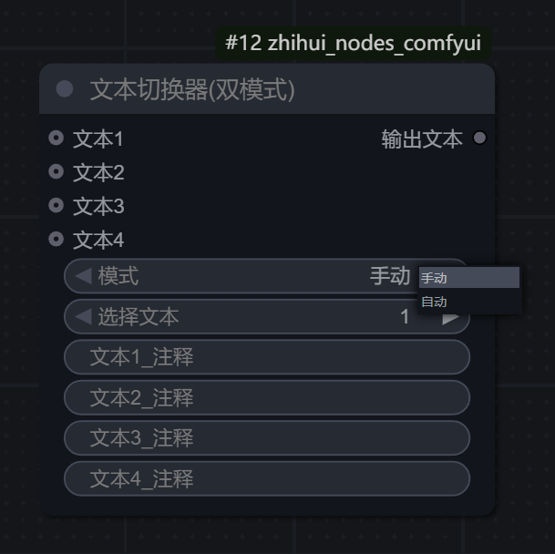

# 🎨 zhihui-nodes-comfyui
[](https://github.com/ZhiHui6/zhihui_nodes_comfyui) [](LICENSE) [](https://github.com/comfyanonymous/ComfyUI)
---

## 📖 项目介绍

这是一个由<span style="color: red;"> **Binity** </span>精心创建的 ComfyUI 自定义节点工具合集，旨在为用户提供一系列实用、高效的节点，以增强和扩展 ComfyUI 的功能。本节点集包含25+功能节点，涵盖文本处理、提示词优化、图像处理、翻译工具、Latent处理等多个方面，为您的 AI 创作提供全方位支持。

### ✨ 主要特点

- 🔄 **双语翻译工具**：配有百度翻译和免费在线翻译节点，支持中英文双向转换
- 📝 **全面文本处理**：提供多行文本编辑、文本合并分离、内容提取修改、语言过滤等5类文本操作节点
- 🎯 **智能提示词系统**：Kontext预设增强版、摄影提示词生成器、万相视频提示词生成器等专业的提示词生成工具
- 🖼️ **实用图像工具**：支持多算法图像缩放、智能切换、颜色移除等等

> 如果这个项目对您有帮助，请给我们一个 ⭐**Star**！您的支持是我们持续改进的动力。

## ⭐ 明星节点

🔥 **<span style="color: #FF6B35; font-weight: bold; font-size: 1.1em;">以下是本节点集中重点推荐的特色节点：</span>**

<table>
<tr>
<th width="30%">节点名称</th>
<th width="15%">类别</th>
<th>核心功能</th>
</tr>

<tr>
<td><b>🎯 Kontext预设增强版</b><br><code>KontextPresetsPlus</code></td>
<td>提示词处理</td>
<td>内置20+创意预设的Kontext图像编辑预设工具，支持用户自定义预设扩展，集成多种LLM模型免费在线智能扩写。</td>
</tr>

<tr>
<td><b>🎬 万相视频提示词生成器</b><br><code>WanPromptGenerator</code></td>
<td>提示词处理</td>
<td>基于万相2.2官方文档编写的全能型提示词生成器，支持自定义和预设两种组合方法，涵盖运镜、场景、光线、构图等17个维度的专业视频提示词生成。</td>
</tr>

<tr>
<td><b>📸 摄影提示词生成器</b><br><code>PhotographPromptGenerator</code></td>
<td>提示词处理</td>
<td>专业摄影风格提示词生成器，涵盖人物、场景、镜头、光线等15个维度，一键生成专业摄影提示词。</td>
</tr>

<tr>
<td><b>🤖 系统引导词加载器</b><br><code>SystemPromptLoader</code></td>
<td>提示词处理</td>
<td>专业系统引导词预设工具，内置众多类别模板，输出引导内容给下游LLM节点生成专业的提示词。</td>
</tr>

<tr>
<td><b>🔍 额外引导选项</b><br><code>ExtraOptions</code></td>
<td>提示词处理</td>
<td>类似JoyCaption额外选项的通用式图像反推辅助，集成了5种反推类型，提供26个精细化选项开关。</td>
</tr>
</table>

> 💡 **使用建议**：新用户建议从 **摄影提示词生成器** 和 **万相视频提示词生成器** 开始体验，这两个节点能够快速提升您的创作效率和作品质量。

---

## 🛠️ 节点功能说明

本节点集包含众多功能各异的节点，分为以下几个主要类别：

### 📝 文本处理类节点

<table>
<tr>
<th width="30%">节点名称</th>
<th>功能描述</th>
</tr>
<tr>
<td><b>多行文本</b><br><code>MultiLineTextNode</code></td>
<td>提供一个支持多行输入的文本框，并带注释功能。

<br>
<div align="left">
<a href="预览图/多行文本.jpg" target="_blank">

</a>
</div></td>
</tr>
<tr>
<td><b>提示词合并器(可注释)</b><br><code>TextCombinerNode</code></td>
<td>合并两个文本输入，并可通过独立的开关控制每个文本的输出，并带注释功能。可用于动态组合不同的提示词部分，灵活构建完整提示。

<br>
<div align="left">
<a href="预览图/提示词合并器.jpg" target="_blank">

</a>
</div></td>
</tr>
<tr>
<td><b>文本修改器</b><br><code>TextModifier</code></td>
<td>根据指定的起始和结束标记提取文本内容，并自动去除多余的空白字符。适合从复杂文本中提取特定部分，或进行格式清理。

<br>
<div align="left">
<a href="预览图/文本修改器.jpg" target="_blank">

</a>
</div></td>
</tr>
<tr>
<td><b>中英文本提取器</b><br><code>TextExtractor</code></td>
<td>从混合文本中提取纯中文或纯英文字符，支持标点和数字的提取，并自动清理格式。对于处理双语提示词或分离不同语言内容非常有用。<br><br>
<div align="left">
<a href="预览图/中英文本提取器.jpg" target="_blank">

</a>
</div></td>
</tr>

<tr>
<td><b>提示词扩展(通用)</b><br><code>TextExpander</code></td>
<td>

使用多种LLM模型对输入文本进行智能扩写和创意增强，支持字符量控制和自定义系统引导词。

<b>特点</b>：
- <b>多模型支持</b>：支持claude、deepseek、gemini、openai、mistral、qwen-coder、llama、sur、unity、searchgpt、evil等11种AI模型
- <b>字符量控制</b>：可精确控制输出文本的字符数量，确保生成内容符合要求
- <b>创意温度调节</b>：通过温度参数控制生成内容的创意程度（0.1-2.0）
- <b>系统引导词</b>：支持自定义系统引导词，引导AI生成特定风格的内容
- <b>灵活输入</b>：支持直接输入系统引导词或通过外部节点加载

<div align="left">
<a href="预览图/提示词扩展(通用).jpg" target="_blank">

</a>
</div>
</td>
</tr>
<tr>
<td><b>文本显示器</b><br><code>ShowText</code></td>
<td>用于在ComfyUI界面中显示文本内容的节点，支持多行文本展示，可实时显示上游节点传递的文本信息，便于调试和查看中间结果。

<br>
<div align="left">
<a href="预览图/文本显示器.jpg" target="_blank">

</a>
</div>
</td>
</tr>
</table>

### 💡 提示词处理类节点

<table>
<tr>
<th width="30%">节点名称</th>
<th>功能描述</th>
</tr>
<tr>
<td><b>Kontext预设基础版</b><br><code>LoadKontextPresetsBasic</code></td>
<td>提供专业的图像变换预设库，包含13项专业预设。为图像生成提供风格化指导，帮助用户快速应用常见的艺术风格和效果。

<br>
<div align="left">
<a href="预览图/Kontext预设集基础版.jpg" target="_blank">

</a>
</div>
</td>
</tr>
<tr>
<td><b>Kontext预设增强版</b><br><code>KontextPresetsPlus</code></td>
<td>

提供专业的图像变换预设，内置免费在线扩写功能，支持用户自定义预设，为图像编辑提供创意指导。

<b>特点</b>：
- <b>丰富预设库</b>：包含20余项专业预设
- <b>双预设库</b>：支持默认预设和用户自定义预设，用户可自由新增更多创意预设，通过分类标识区分预设来源。<a href="doc/Kontext预设_用户文件说明.md" style="font-weight:bold;color:yellow;">用户预设使用说明</a>
- <b>智能扩写</b>：支持多种LLM模型（OpenAI、Mistral、Qwen等）对预设内容进行创意扩写
- <b>灵活输出</b>：支持输出原始预设内容、完整信息或AI扩写后的内容

<div align="left">
<a href="预览图/Kontext预设增强版节点展示.jpg" target="_blank">

</a>
<a href="预览图/Kontext预设增强版效果预览.jpg" target="_blank">

</a>
</div>
</td>
</tr>
<tr>
<td><b>摄影提示词生成器</b><br><code>PhotographPromptGenerator</code></td>
<td>

根据预设的摄影要素（如相机、镜头、光照、场景等）组合生成专业的摄影风格提示词。

<b>特点</b>：
- 支持从自定义文本文件加载选项，灵活扩展
- 支持随机选择，增加创意多样性
- 输出模板可自定义，适应不同的摄影风格需求

<div align="left">
<a href="预览图/摄影提示词生成器.jpg" target="_blank">

</a>
</div>
</td>
</tr>
<tr>
<td><b>万相视频提示词生成器</b><br><code>WanPromptGenerator</code></td>
<td>

基于万相2.2官方文档编写的全能型提示词生成器，支持自定义和预设两种组合方法，涵盖运镜、场景、光线、构图等16个维度的专业视频提示词生成。

<b>特点</b>：
- <b>双模式切换</b>：支持自定义组合和预设组合模式，通过开关按钮一键切换
- <b>多维度选择</b>：涵盖主体类型、场景类型、光源类型、光线类型、时间段、景别、构图、镜头焦段、机位角度、镜头类型、色调、运镜方式、人物情绪、运动类型、视觉风格、特效镜头、动作姿势17个专业维度
- <b>智能扩写</b>：支持多种LLM模型（OpenAI、Claude、DeepSeek、Gemini等）免费在线扩写

<div align="left">
<a href="预览图/万相视频提示词生成器.jpg" target="_blank">

</a>
</div>
</td>
</tr>

<tr>
<td><b>提示词预设 - 单选</b><br><code>PromptPresetOneChoice</code></td>
<td>提供6个预设选项，用户可以方便地在不同预设之间切换。适合保存常用的提示词模板，快速应用到不同场景。

<br>
<div align="left">
<a href="预览图/单选提示词预设.jpg" target="_blank">

</a>
</div>
</td>
</tr>
<tr>
<td><b>提示词预设 - 多选</b><br><code>PromptPresetMultipleChoice</code></td>
<td>支持同时选择多个预设，并将它们合并输出，每个预设都带有独立的开关和注释功能。适合构建复杂的组合提示词，灵活控制各部分的启用状态。

<br>
<div align="left">
<a href="预览图/多选提示词预设.jpg" target="_blank">

</a>
</div>
</td>
</tr>
<tr>
<td><b>触发词合并器</b><br><code>TriggerWordMerger</code></td>
<td>将特定的触发词（Trigger Words）与主文本智能合并，并支持权重控制（例如 <code>(word:1.5)</code>）。适用于添加模型特定的触发词或风格词，并精确控制其影响强度。

<br>
<div align="left">
<a href="预览图/触发词合并器.jpg" target="_blank">

</a>
</div>
</td>
</tr>
<tr>
<td><b>系统引导词加载器</b><br><code>SystemPromptLoader</code></td>
<td>从预设文件夹动态加载系统级引导词（System Prompt），并可选择性地与用户输入合并。适合管理和应用复杂的系统提示模板，提高生成结果的一致性和质量。<br><br>
<div align="left">
<a href="预览图/系统引导词加载器.jpg" target="_blank">

</a>
</div>
</td>
</tr>
<tr>
<td><b>系统引导词加载器(基础版)</b><br><code>SystemPromptLoaderBase</code></td>
<td>从预设文件夹动态加载系统级引导词（System Prompt），简化了节点功能，适合需要纯系统引导词的场景。<br><br>
<div align="left">
<a href="预览图/系统引导词加载器基础版.jpg" target="_blank">

</a>
</div>
</td>
</tr>
<tr>
<td><b>额外选项列表</b><br><code>ExtraOptions</code></td>
<td>一个通用的额外选项列表，类似于 JoyCaption 的设计，设有总开关和独立的引导词输入框。适合添加辅助提示或控制参数，增强工作流的灵活性。<br><br>
<div align="left">
<a href="预览图/额外引导选项（通用）.jpg" target="_blank">

</a>
</div></td>
</tr>
</table>

### 🖼️ 图像处理类节点

<table>
<tr>
<th width="30%">节点名称</th>
<th>功能描述</th>
</tr>
<tr>
<td><b>图像缩放器</b><br><code>ImageScaler</code></td>
<td>提供多种插值算法对图像进行缩放，并可选择保持原始宽高比。支持高质量的图像尺寸调整，适用于预处理或后处理阶段。

<br>
<div align="left">
<a href="预览图/图像缩放器.jpg" target="_blank">

</a>
</div>
</td>
</tr>
<tr>
<td><b>颜色移除</b><br><code>ColorRemoval</code></td>
<td>从图像中移除彩色，输出灰度图像。适用于创建黑白效果或作为特定图像处理流程的预处理步骤。<br><br>
<a href="预览图/去色节点展示.png" target="_blank"></a></td>
</tr>
</table>

### 🎞️ 电影后期处理类节点

<table>
<tr>
<th width="30%">节点名称</th>
<th>功能描述</th>
</tr>
<tr>
<td><b>胶片颗粒效果</b><br><code>FilmGrain</code></td>
<td>

为图像添加逼真的胶片颗粒效果，营造经典胶片质感。
- <b>双分布模式</b>：支持高斯分布（自然胶片噪点）和平均分布（数字均匀噪点）
- <b>饱和度混合</b>：独立控制彩色/单色颗粒比例，实现从彩色胶片到黑白胶片的平滑过渡

<br>
<div align="left">
<a href="预览图/胶片颗粒.jpg" target="_blank">

</a>
</div>
</td>
</tr>

<tr>
<td><b>拉普拉斯锐化</b><br><code>LaplacianSharpen</code></td>
<td>

基于拉普拉斯算子的边缘锐化工具，通过二阶微分检测图像边缘并增强细节，适合风景和人像的细节增强。

<br>
<div align="left">
<a href="预览图/拉普拉斯锐化.jpg" target="_blank">

</a>
</div>
</td>
</tr>
<tr>

<td><b>索贝尔锐化</b><br><code>SobelSharpen</code></td>
<td>
采用索贝尔算子的方向性锐化工具，通过梯度计算同时增强水平和垂直边缘，适合需要强调纹理的场景。

<br>
<div align="left">
<a href="预览图/索贝尔锐化.jpg" target="_blank">

</a>
</div>
</td>
</tr>
<tr>
<td><b>USM锐化</b><br><code>USMSharpen</code></td>
<td>
使用经典USM锐化技术来增强细节，对目标图像进行自然的锐化处理。

<br>
<div align="left">
<a href="预览图/USM锐化.jpg" target="_blank">

</a>
</div>
</td>
</tr>
<tr>
<td><b>色彩匹配</b><br><code>ColorMatchToReference</code></td>
<td>
智能色彩匹配工具，可将参考图像的色调风格应用到目标图像，实现专业级色彩统一。

<br>
<div align="left">
<a href="预览图/颜色匹配.jpg" target="_blank">

</a>
</div>
</td>
</tr>
</table>

### ⚙️ 逻辑与工具类节点

<table>
<tr>
<th width="30%">节点名称</th>
<th>功能描述</th>
</tr>
<tr>
<td><b>Latent切换器(双模式)</b><br><code>LatentSwitch</code></td>
<td>支持3个Latent输入的双模式切换器，可通过下拉菜单手动选择输出，或启用自动模式智能检测单个有效输入。

<br>
<div align="left">
<a href="预览图/Latent切换器.jpg" target="_blank">

</a>
</div>
</td>
</tr>
<tr>
<td><b>文本切换器(双模式)</b><br><code>TextSwitchDualMode</code></td>
<td>支持4个文本输入的双模式切换器，可通过下拉菜单手动选择输出，或启用自动模式智能检测单个有效输入。便于在不同版本的提示词之间快速切换，进行对比实验。

<br>
<div align="left">
<a href="预览图/文本切换器.jpg" target="_blank">

</a>
</div>
</td>
</tr>
<tr>
<td><b>图像切换器(双模式)</b><br><code>ImageSwitchDualMode</code></td>
<td>支持在2个或4个图像输入之间进行切换的双模式切换器，可通过下拉菜单手动选择输出，或启用自动模式智能检测单个有效输入。便于比较不同生成结果或应用不同的图像处理路径。

<br>
<div align="left">
<a href="预览图/图像切换器.jpg" target="_blank">

</a>
</div>
</td>
</tr>
<tr>
<td><b>优先级图像切换</b><br><code>PriorityImageSwitch</code></td>
<td>智能优先级图像切换节点，当同时接入图像A和图像B端口时，优先输出B端口的内容；如果B端口无输入，则输出图像A端口的内容；如果两个端口都无输入，则弹出提示要求至少连接一个输入端口。

<b>特点</b>：
- <b>优先级控制</b>：图像B端口优先级高于图像A端口
- <b>智能切换</b>：自动检测输入状态，无缝切换输出，减少手动切换操作

<br>
<div align="left">
<a href="预览图/优先级图像切换.jpg" target="_blank">

</a>
</div></td>
</tr>
<tr>
<td><b>百度翻译</b><br><code>BaiduTranslate</code></td>
<td>

提供在线翻译服务，支持中英文互译和源语言自动检测。

<b>密钥加载</b>：
- <b>明文加载</b>：直接在节点中输入 <code>APP_ID</code> 和 <code>API_KEY</code>
- <b>后台加载</b>：从配置文件读取密钥，保护隐私安全

<b>注意</b>：
- 需在<a href="https://api.fanyi.baidu.com/">百度翻译开放平台</a>注册并获取密钥
- 使用此节点需要网络连接
- 后台加载方式需要先修改配置文件"baidu_translate_config.json"后重启ComfyUI。（配置文件路径：...\custom_nodes\zhihui_nodes_comfyui\Nodes\Translate）

<div align="left">
<a href="预览图/百度翻译.jpg" target="_blank">

</a>
</div>
</td>
</tr>
<tr>
<td><b>免费在线翻译</b><br><code>FreeTranslate</code></td>
<td>

免费在线翻译服务，支持中英文双向翻译和自动语言检测。

<b>特点</b>：
- <b>免费使用</b>：无需注册或API密钥，开箱即用
- <b>多模型支持</b>：提供11种AI模型选择（OpenAI、Claude、DeepSeek、Gemini等）

<div align="left">
<a href="预览图/中英文翻译器.jpg" target="_blank">

</a>
</div>
</td>
</tr>
<tr>
<td><b>本地文件画廊</b><br><code>LocalFileGallery</code></td>
<td>

本地文件浏览和选择工具，提供直观的文件管理界面，支持图片和文本文件的预览与选择。

<b>支持格式</b>：
- <b>图片格式</b>：jpg, jpeg, png, bmp, gif, webp
- <b>文本格式</b>：txt, json, js

<b>特点</b>：
- <b>可视化界面</b>：提供友好的文件浏览器界面
- <b>双输出模式</b>：同时输出选中的图片（IMAGE类型）和文本内容（STRING类型）
- <b>安全验证</b>：内置路径安全检查和文件格式验证
- <b>缓存优化</b>：LRU缓存机制提升文件加载性能
- <b>缩略图支持</b>：快速预览图片内容

<div align="left">
<a href="预览图/本地文件画廊.jpg" target="_blank">

</a>
</div>
</td>
</tr>
</table>

---

## 🚀 安装方式

### 📦 通过 ComfyUI Manager 安装（推荐）

1. 安装 [ComfyUI Manager](https://github.com/ltdrdata/ComfyUI-Manager)
2. 在 Manager 菜单中选择 "Install Custom Nodes"
3. 搜索 `zhihui_nodes_comfyui`（暂未支持） ，或通过 Git URL 进行安装：
   ```
   https://github.com/ZhiHui6/zhihui_nodes_comfyui.git
   ```
4. 点击 "Install" 按钮并等待安装完成
5. 重启 ComfyUI，即可在节点菜单中找到新添加的节点

### 🔧 手动安装

1. 下载本仓库的 ZIP 文件或通过 Git 克隆：
   ```bash
   git clone https://github.com/ZhiHui6/zhihui_nodes_comfyui.git
   ```
2. 将整个 `zhihui_nodes_comfyui` 文件夹解压或复制到 ComfyUI 的 `custom_nodes` 目录下
3. 重启 ComfyUI

---

### 📋 依赖项

本节点集大部分功能无需额外依赖，开箱即用。部分在线功能（如翻译、提示词优化）需要网络连接。

如需手动安装依赖，可执行：

```bash
pip install -r requirements.txt
```
## 🤝 贡献指南

我们欢迎各种形式的贡献，包括但不限于：
<div align="left">
[🔴报告问题和提出建议] | [💡提交功能请求] | [📚改进文档] | [💻提交代码贡献]
</div>

如果您有任何想法或建议，请随时提出 Issue 或 Pull Request。