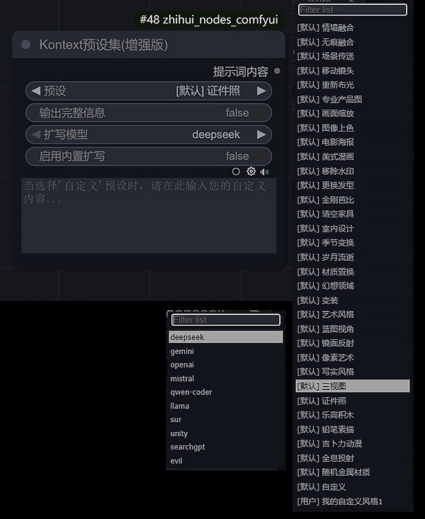

<div align="center">

# 🎨 zhihui-nodes-comfyui 自定义节点集

<p style="color: #2C3E50; font-size: 18px; font-weight: bold;">✨ 专业的 ComfyUI 自定义节点工具合集 ✨</p>

</div>

## 📖 项目介绍

> 🌟 这是一个由 **<span style="color: #E74C3C;">潪绘·Binity</span>** 所创建的ComfyUI自定义节点工具合集项目，旨在为用户提供一系列实用、高效的节点，以增强和扩展ComfyUI的功能。

<div style="background: linear-gradient(90deg, #667eea 0%, #764ba2 100%); padding: 15px; border-radius: 10px; margin: 20px 0;">
<p style="color: white; margin: 0; text-align: center; font-weight: bold;">🚀 让您的 ComfyUI 工作流更加强大和高效！</p>
</div>

## 🚀 安装方式

### 🎯 通过 ComfyUI Manager 安装（<span style="color: #27AE60;">推荐</span>）

<div style="background-color: #E8F5E8; padding: 15px; border-left: 4px solid #27AE60; margin: 10px 0;">

1. 📦 安装 [ComfyUI Manager](https://github.com/ltdrdata/ComfyUI-Manager)
2. 🔍 在 Manager 菜单中选择 **"Install Custom Nodes"**
3. 🔎 搜索 `zhihui-nodes-comfyui` 或通过 Git URL：
   ```
   <span style="color: #2C3E50; font-weight: bold;">https://github.com/ZhiHui6/zhihui-nodes-comfyui.git</span>
   ```
  
4. ⬇️ 点击 **"Install"** 按钮并等待安装完成
5. 🔄 重启 ComfyUI，即可在节点菜单中找到新添加的节点

</div>

### 🛠️ 手动安装

<div style="background-color: #FFF3CD; padding: 15px; border-left: 4px solid #FFC107; margin: 10px 0;">

1. 📥 下载本仓库的ZIP文件或通过 `git clone` 克隆
2. 📁 将整个 `zhihui-nodes-comfyui` 文件夹解压或复制到 ComfyUI 的 `custom_nodes` 目录下
3. 🔄 重启 ComfyUI

</div>

---

---

## 🛠️ 节点功能说明

<div style="background: linear-gradient(135deg, #667eea 0%, #764ba2 100%); padding: 20px; border-radius: 15px; margin: 20px 0;">
<h3 style="color: white; margin: 0; text-align: center;">🎯 功能丰富的节点生态系统</h3>
<p style="color: #F8F9FA; margin: 10px 0 0 0; text-align: center; font-weight: 500;">涵盖文本处理、图像操作、提示词优化等多个领域</p>
</div>

### 📝 文本处理类节点

<div style="background-color: #F8F9FA; padding: 15px; border-radius: 10px; margin: 15px 0;">

#### 📄 1. 多行文本 (`MultiLineTextNode`)
- **🎯 功能**: 提供一个支持多行输入的文本框，并带有<span style="color: #E74C3C;">语法高亮</span>和<span style="color: #E74C3C;">注释功能</span>，支持变量替换

#### 🔗 2. 文本组合 (`TextCombinerNode`)
- **🎯 功能**: 合并两个文本输入，并可通过<span style="color: #3498DB;">独立的开关</span>控制每个文本的输出

#### ✂️ 3. 文本修改器 (`TextModifier`)
- **🎯 功能**: 根据指定的起始和结束标记提取文本内容，并<span style="color: #27AE60;">自动去除多余的空白字符</span>

#### 🔍 4. 文本提取器 (`TextExtractor`)
- **🎯 功能**: 从混合文本中提取纯中文或纯英文字符，支持<span style="color: #9B59B6;">标点和数字的提取</span>，并自动清理格式

#### 🔄 5. 文本切换器 (`TextSwitch`)
- **🎯 功能**: 在两个文本输入之间进行切换，可通过<span style="color: #F39C12;">下拉菜单选择输出</span>，并支持添加注释

</div>

### 💡 提示词处理类节点

<div style="background-color: #FFF8E1; padding: 15px; border-radius: 10px; margin: 15px 0;">

#### 🎨 6. Kontext预设基础版 (`LoadKontextPresetsBasic`)
- **🎯 功能**: 提供专业的图像变换预设库，包含<span style="color: #E74C3C;">13项专业预设</span>

#### ⭐ 7. Kontext预设增强版 (`KontextPresetsPlus`) 
- **🎯 功能**: 提供专业的图像变换预设，内置<span style="color: #27AE60;">免费在线扩写功能</span>，支持用户自定义预设，为图像编辑提供创意指导
- **✨ 特点**:
  - 📚 **丰富预设库**: 包含<span style="color: #E74C3C;">20余项专业预设</span>
  - 🔄 **双预设库**: 支持默认预设和用户自定义预设，用户可自由新增更多创意预设，通过分类标识区分预设来源
    > 📁 用户预设文件"user_presets"位于"..\custom_nodes\zhihui_nodes_comfyui\KontextPresets\KontextPresetsPlus"
  - 🤖 **智能扩写**: 支持多种LLM模型（<span style="color: #3498DB;">OpenAI、Mistral、Qwen等</span>）对预设内容进行创意扩写
  - 🎛️ **灵活输出**: 支持输出原始预设内容、完整信息或AI扩写后的内容

<div align="center" style="margin: 20px 0;">

| 🖼️ 节点展示 | 🎨 效果预览 |
|:---:|:---:|
|  |  |

</div>

#### 📸 8. 摄影提示词生成器 (`PhotographPromptGenerator`)
- **🎯 功能**: 根据预设的摄影要素（如相机、镜头、光照、场景等）组合生成<span style="color: #E74C3C;">专业的摄影风格提示词</span>
- **✨ 特点**: 
  - 📁 支持从自定义文本文件加载选项，<span style="color: #27AE60;">灵活扩展</span>
  - 🎲 支持随机选择，<span style="color: #9B59B6;">增加创意多样性</span>
  - 🎨 输出模板可自定义

#### 🚀 9. 提示词优化器 (`PromptOptimizer`)
- **🎯 功能**: <span style="color: #3498DB;">在线智能扩写</span>和优化用户输入的提示词，<span style="color: #27AE60;">无需本地硬件支持</span>
- **⚙️ 模式**: 提供<span style="color: #E74C3C;">标准、详细和自定义</span>三种扩写模式
- **🌐 语言**: 支持<span style="color: #F39C12;">中英文双语输出</span>

#### 🎯 10. 提示词预设 - 单选 (`PromptPresetOneChoice`)
- **🎯 功能**: 提供<span style="color: #E74C3C;">6个预设选项</span>，用户可以方便地在不同预设之间切换

#### 🎛️ 11. 提示词预设 - 多选 (`PromptPresetMultipleChoice`)
- **🎯 功能**: 支持<span style="color: #27AE60;">同时选择多个预设</span>，并将它们合并输出，每个预设都带有独立的开关和注释功能

#### 🔗 12. 触发词合并器 (`TriggerWordMerger`)
- **🎯 功能**: 将特定的触发词（Trigger Words）与主文本<span style="color: #3498DB;">智能合并</span>，并支持权重控制（例如 `(word:1.5)`）

#### 📋 13. 系统引导词加载器 (`SystemPromptLoader`)
- **🎯 功能**: 从预设文件夹<span style="color: #9B59B6;">动态加载系统级引导词</span>（System Prompt），并可选择性地与用户输入合并

</div>

### 🖼️ 图像处理类节点

<div style="background-color: #E3F2FD; padding: 15px; border-radius: 10px; margin: 15px 0;">

#### 🔍 14. 图像缩放器 (`ImageScaler`)
- **🎯 功能**: 提供<span style="color: #3498DB;">多种插值算法</span>对图像进行缩放，并可选择<span style="color: #27AE60;">保持原始宽高比</span>

#### 🔄 15. 图像切换器 (`ImageSwitch`)
- **🎯 功能**: 支持在<span style="color: #E74C3C;">2个或4个图像输入</span>之间进行切换，通过下拉菜单选择输出

#### 🤖 16. 自动图像检测器 (`AutoImageSwitch`)
- **🎯 功能**: <span style="color: #9B59B6;">自动检测</span>多个输入端口中哪一个有图像输入，并将其无缝输出到下游节点
- **⚠️ 注意**: 仅支持<span style="color: #F39C12;">单端口有图像输入</span>的场景，多端口同时输入会报错

</div>

### ⚙️ 逻辑与工具类节点

<div style="background-color: #F3E5F5; padding: 15px; border-radius: 10px; margin: 15px 0;">

#### 📋 17. 额外选项列表 (`ExtraOptions`)
- **🎯 功能**: 一个通用的额外选项列表，类似于 <span style="color: #3498DB;">JoyCaption</span> 的设计，设有总开关和独立的引导词输入框

#### 🌐 18. 百度翻译 (`BaiduTranslateNode`)
- **🎯 功能**: 提供<span style="color: #27AE60;">在线翻译服务</span>，支持中英文互译和源语言自动检测
- **🔑 密钥加载**: 
  - 📝 **明文加载**: 直接在节点中输入 `APP_ID` 和 `API_KEY`
  - 🔒 **后台加载**: 从配置文件读取密钥，<span style="color: #E74C3C;">保护隐私安全</span>
- **⚠️ 注意**: 
  - 需在[百度翻译开放平台](https://api.fanyi.baidu.com/)注册并获取密钥
  - 使用此节点需要网络连接

#### 🆓 19. 中英文互译器 测试版 (`TranslateNodeBeta`)
- **🎯 功能**: <span style="color: #27AE60;">免费在线翻译服务</span>，支持中英文双向翻译和自动语言检测
- **✨ 特点**:
  - 🎁 **免费使用**: <span style="color: #E74C3C;">无需注册或API密钥</span>，开箱即用
  - 🤖 **多模型支持**: 提供多种AI模型选择（<span style="color: #3498DB;">OpenAI、Gemini、DeepSeek等</span>）

#### 🎨 20. 颜色移除 (`ColorRemoval`)
- **🎯 功能**: 从图像中移除彩色，输出<span style="color: #9B59B6;">灰度图像</span>

</div>

---

<div style="background: linear-gradient(135deg, #667eea 0%, #764ba2 100%); padding: 20px; border-radius: 15px; margin: 30px 0; text-align: center;">
<h2 style="color: white; margin: 0;">🎉 感谢使用 zhihui-nodes-comfyui！</h2>
<p style="color: #F8F9FA; margin: 10px 0 0 0; font-weight: 500;">如果这个项目对您有帮助，请给我们一个 ⭐ Star！</p>
</div>

## 📜 LICENSE

<div style="background-color: #F8F9FA; padding: 15px; border-radius: 10px; border-left: 4px solid #6C757D;">

📄 This project is licensed under the **MIT License**. See the [LICENSE](LICENSE) file for details.

</div>

<div align="center" style="margin-top: 30px;">

---

**🔗 相关链接**

[](https://github.com/ZhiHui6/zhihui-nodes-comfyui)
[](LICENSE)
[](https://github.com/comfyanonymous/ComfyUI)

**Made with ❤️ by 潪绘·Binity**

</div>
